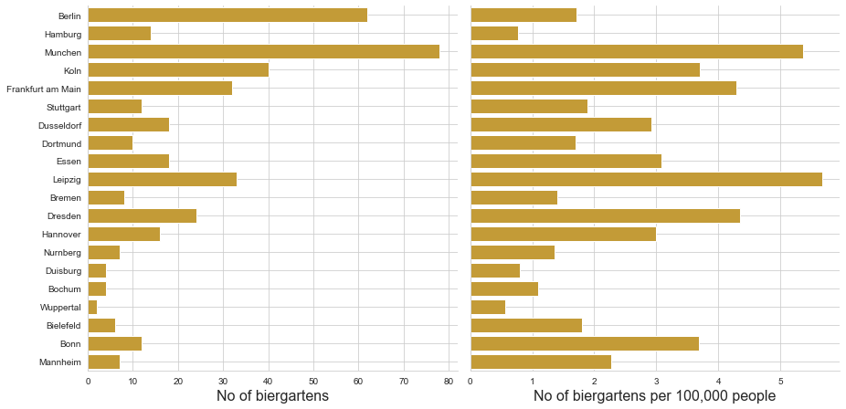
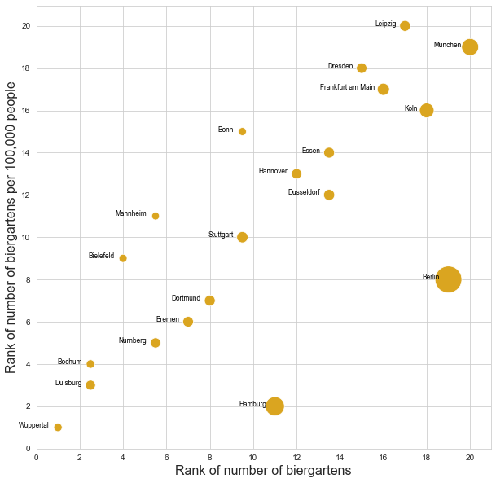
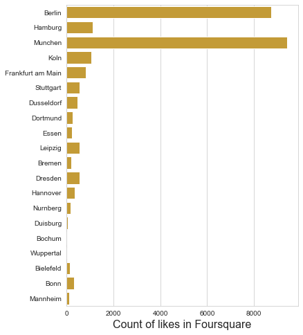
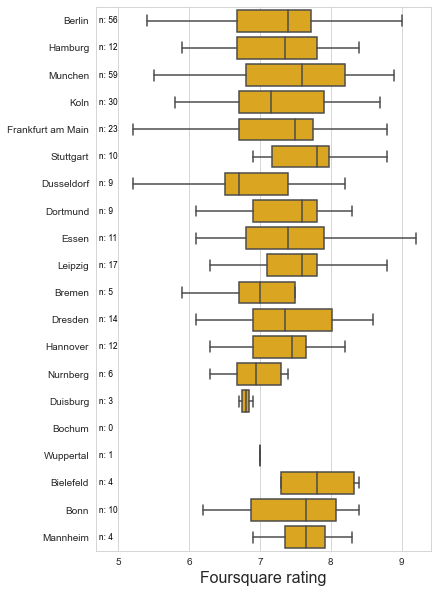
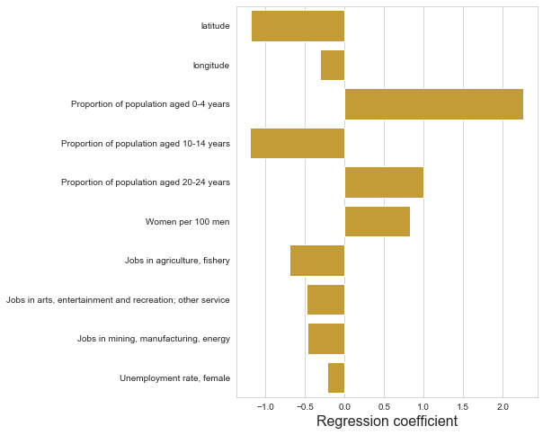
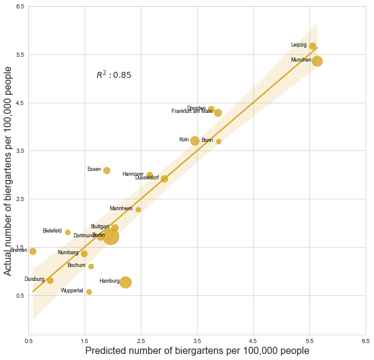

# Biergartens in Germany - Where to travel if you can't attend Oktoberfest?

## Introduction

Bavaria, region at South-East Germany, is well known for it's beer culture. Bavarian purity law has stated since 1516 that beer is to be made of four ingredients: water, malt, hops and yeast. Munich, capital of Bavaria, is particularly well known for Oktoberfest which is celebrated elsewhere in Germany as well. Hence, if you are a traveler looking for once in a lifetime beer experience, you should probably attend Oktoberfest in Munich. But what if that's not possible? You may be traveling at different time of the year, or in another part of Germany. Where should you go? Obvious solution is to try out one, two or more biergartens, which can be found anywhere in Germany. 

This analysis attempts to determine where a traveler can get the best biergarten experience. The analysis will be conducted by asking the following questions and answering them by data analysis techniques.

- Where can you find most biergartens?
- Are biergartens equally popular in different regions?
- Do biergarten reviews in Foursquare hint where to go to?
- Does population structure or labour statistics explain density of biergartens?

## Data

Regional statistics of German population and society were fetched from [Eurostat City Statistics Database](https://ec.europa.eu/eurostat/web/cities/data/database).

Locations of biergartens were got from OpenStreetMap where they are tagged. According to [OpenStreetMap Wiki](https://wiki.openstreetmap.org/wiki/Tag:amenity%3Dbiergarten) the tagging is very accurate since biergarten is distinquished from beer garden.

[Foursquare API](https://developer.foursquare.com/docs/) was be used to fetch reviews of venues in categories *german pubs*, *bars* and *restaurants*. Biergartens were found by matching Foursquare venue location to OpenStreetMap location allowing radius of 25 meters.

## Methodology

The analysis was conducted by comparing the 20 largest cities in Germany. the list of cities was obtained from [World Population Review website](https://worldpopulationreview.com/countries/germany-population/cities/).

### Data Preparation

Data collection was by far the most tedious task in the project due to multiple online sources previously unfamiliar to the me. To enable easy and reproducible data collection, a python package was created to consistently query Eurostat, OpenStreetMap and Foursquare APIs. The package can be found in and installed from the [project Github repository](https://github.com/Mtale/Coursera_Capstone).

Once the data collection package was complete, it was used to run the following process:

1) Get all biergartens from OpenStreeMap

2) Match OpenStreeMap biergartens to Foursquare venues by coordinates allowing 25 meters radius. This phase introduces some inaccuracy in the process due to different data types in OpenStreetMap: some large biergartens have been expressed as [ways](https://wiki.openstreetmap.org/wiki/Way) or [relations](https://wiki.openstreetmap.org/wiki/Relation) instead of [nodes](https://wiki.openstreetmap.org/wiki/Node). It's  possible some of the large biergartens have been dropped out from the analysis if center point of polygon (way or relation) is more than 25 meters off of coordinates of a Foursquare venue. Setting a radius is a matter of balancing: too large radius allows other *pubs* and *german restaurants* to enter the dataset if they are next door neighbors of the actual biergarten. The few venues having fit to the radius of a biergarten are included in the dataset.

3) Get likes count and rating of each venue from foursquare

At last, the biergarten data was merged to Eurostat data to create a single dataframe containing the data needed in the analysis. The data preparation phase was executed in the notebook [Data Preparation](https://github.com/Mtale/Coursera_Capstone/blob/master/Data%20Preparation.ipynb).

### Exploratory Data Analysis

Exploratory data analysis (EDA) was conducted to examine quality of the dataset created in the data preparation phase. During the analysis it turned out that large part of the data acquired from Eurostat was missing - most likely due to self-set requirement that the data should be at most 4 years old, from between 2016-2019. Out of 145 variables from Eurostat 41 were excluded from further analysis due to high number of missing values. 

In the end, 38 easy-to-understand, non-correlating variables describing population structure and labour market of each city were included in the analysis. Population variables and some labour market variables were already proportional, number of jobs in industry were scaled to number of jobs per 1,000 inhabitants.

In the last phase of EDA the most recent observation of each variable for each city was included in tidy dataset where biergartens were on rows and variables on columns.

EDA was executed in the notebook [Exploratory Data Analysis](https://github.com/Mtale/Coursera_Capstone/blob/master/EDA.ipynb).

### Statistical Analysis

The objective of statistical analysis was to answer the predefined questions:

- Where can you find most biergartens?
- Are biergartens equally popular in different regions?
- Do biergarten reviews in Foursquare hint where to go to?
- Does population structure or labour statistics explain density of biergartens?

The questions were answered by appropriate plotting techniques and visual analysis. An attempt to explain biergarten density per 100,000 people was made by using linear regression. The regression model was run on the dataset where variables having high correlation were excluded to avoid multicollinearity thus enabling interpretation of results.

The analysis was done in the notebook [Analysis](https://github.com/Mtale/Coursera_Capstone/blob/master/Analysis.ipynb).

## Results

### Number of biergartens in the 20 largest cities
Let's start by having a look at where are the 20 largest cities in Germany. The following map shows their location. Color of marker depicts the number of biergartens the city hosts per 100,000 people.

<iframe src="about:blank" style="position:absolute;width:100%;height:100%;left:0;top:0;border:none !important;" data-html=PCFET0NUWVBFIGh0bWw+CjxoZWFkPiAgICAKICAgIDxtZXRhIGh0dHAtZXF1aXY9ImNvbnRlbnQtdHlwZSIgY29udGVudD0idGV4dC9odG1sOyBjaGFyc2V0PVVURi04IiAvPgogICAgPHNjcmlwdD5MX1BSRUZFUl9DQU5WQVMgPSBmYWxzZTsgTF9OT19UT1VDSCA9IGZhbHNlOyBMX0RJU0FCTEVfM0QgPSBmYWxzZTs8L3NjcmlwdD4KICAgIDxzY3JpcHQgc3JjPSJodHRwczovL2Nkbi5qc2RlbGl2ci5uZXQvbnBtL2xlYWZsZXRAMS4yLjAvZGlzdC9sZWFmbGV0LmpzIj48L3NjcmlwdD4KICAgIDxzY3JpcHQgc3JjPSJodHRwczovL2FqYXguZ29vZ2xlYXBpcy5jb20vYWpheC9saWJzL2pxdWVyeS8xLjExLjEvanF1ZXJ5Lm1pbi5qcyI+PC9zY3JpcHQ+CiAgICA8c2NyaXB0IHNyYz0iaHR0cHM6Ly9tYXhjZG4uYm9vdHN0cmFwY2RuLmNvbS9ib290c3RyYXAvMy4yLjAvanMvYm9vdHN0cmFwLm1pbi5qcyI+PC9zY3JpcHQ+CiAgICA8c2NyaXB0IHNyYz0iaHR0cHM6Ly9jZG5qcy5jbG91ZGZsYXJlLmNvbS9hamF4L2xpYnMvTGVhZmxldC5hd2Vzb21lLW1hcmtlcnMvMi4wLjIvbGVhZmxldC5hd2Vzb21lLW1hcmtlcnMuanMiPjwvc2NyaXB0PgogICAgPGxpbmsgcmVsPSJzdHlsZXNoZWV0IiBocmVmPSJodHRwczovL2Nkbi5qc2RlbGl2ci5uZXQvbnBtL2xlYWZsZXRAMS4yLjAvZGlzdC9sZWFmbGV0LmNzcyIvPgogICAgPGxpbmsgcmVsPSJzdHlsZXNoZWV0IiBocmVmPSJodHRwczovL21heGNkbi5ib290c3RyYXBjZG4uY29tL2Jvb3RzdHJhcC8zLjIuMC9jc3MvYm9vdHN0cmFwLm1pbi5jc3MiLz4KICAgIDxsaW5rIHJlbD0ic3R5bGVzaGVldCIgaHJlZj0iaHR0cHM6Ly9tYXhjZG4uYm9vdHN0cmFwY2RuLmNvbS9ib290c3RyYXAvMy4yLjAvY3NzL2Jvb3RzdHJhcC10aGVtZS5taW4uY3NzIi8+CiAgICA8bGluayByZWw9InN0eWxlc2hlZXQiIGhyZWY9Imh0dHBzOi8vbWF4Y2RuLmJvb3RzdHJhcGNkbi5jb20vZm9udC1hd2Vzb21lLzQuNi4zL2Nzcy9mb250LWF3ZXNvbWUubWluLmNzcyIvPgogICAgPGxpbmsgcmVsPSJzdHlsZXNoZWV0IiBocmVmPSJodHRwczovL2NkbmpzLmNsb3VkZmxhcmUuY29tL2FqYXgvbGlicy9MZWFmbGV0LmF3ZXNvbWUtbWFya2Vycy8yLjAuMi9sZWFmbGV0LmF3ZXNvbWUtbWFya2Vycy5jc3MiLz4KICAgIDxsaW5rIHJlbD0ic3R5bGVzaGVldCIgaHJlZj0iaHR0cHM6Ly9yYXdnaXQuY29tL3B5dGhvbi12aXN1YWxpemF0aW9uL2ZvbGl1bS9tYXN0ZXIvZm9saXVtL3RlbXBsYXRlcy9sZWFmbGV0LmF3ZXNvbWUucm90YXRlLmNzcyIvPgogICAgPHN0eWxlPmh0bWwsIGJvZHkge3dpZHRoOiAxMDAlO2hlaWdodDogMTAwJTttYXJnaW46IDA7cGFkZGluZzogMDt9PC9zdHlsZT4KICAgIDxzdHlsZT4jbWFwIHtwb3NpdGlvbjphYnNvbHV0ZTt0b3A6MDtib3R0b206MDtyaWdodDowO2xlZnQ6MDt9PC9zdHlsZT4KICAgIAogICAgICAgICAgICA8c3R5bGU+ICNtYXBfYTQ0N2YwYmZmMGIzNDQ4NDhmZGYxZDJiM2JlYzM3NzEgewogICAgICAgICAgICAgICAgcG9zaXRpb24gOiByZWxhdGl2ZTsKICAgICAgICAgICAgICAgIHdpZHRoIDogMTAwLjAlOwogICAgICAgICAgICAgICAgaGVpZ2h0OiAxMDAuMCU7CiAgICAgICAgICAgICAgICBsZWZ0OiAwLjAlOwogICAgICAgICAgICAgICAgdG9wOiAwLjAlOwogICAgICAgICAgICAgICAgfQogICAgICAgICAgICA8L3N0eWxlPgogICAgICAgIAo8L2hlYWQ+Cjxib2R5PiAgICAKICAgIAogICAgIDxkaXYgc3R5bGU9InBvc2l0aW9uOiBmaXhlZDsgYm90dG9tOiA1MHB4OyBsZWZ0OiA1MHB4OyB3aWR0aDogMTUwcHg7IGhlaWdodDogMjAwcHg7ICAgICAgYm9yZGVyOjJweCBzb2xpZCBncmV5OyB6LWluZGV4Ojk5OTk7IGZvbnQtc2l6ZToxNHB4OyIgPgogICAgICZuYnNwOyBObyBvZiBiaWVyZ2FydGVucyA8YnI+CiAgICAgJm5ic3A7IHBlciAxMDAsMDAwIHBlb3BsZSA8YnI+CiAgICAgJm5ic3A7IDUgKyAmbmJzcDsgPGkgY2xhc3M9ImZhIGZhLW1hcC1tYXJrZXIgZmEtMngiCiAgICAgICAgICAgICAgICAgIHN0eWxlPSJjb2xvcjpkYXJrcHVycGxlIj48L2k+PGJyPgogICAgICZuYnNwOyA0LTUgJm5ic3A7IDxpIGNsYXNzPSJmYSBmYS1tYXAtbWFya2VyIGZhLTJ4IgogICAgICAgICAgICAgICAgICBzdHlsZT0iY29sb3I6cmVkIj48L2k+PGJyPgogICAgICZuYnNwOyAzLTQgJm5ic3A7IDxpIGNsYXNzPSJmYSBmYS1tYXAtbWFya2VyIGZhLTJ4IgogICAgICAgICAgICAgICAgICBzdHlsZT0iY29sb3I6b3JhbmdlIj48L2k+PGJyPgogICAgICZuYnNwOyAyLTMgJm5ic3A7IDxpIGNsYXNzPSJmYSBmYS1tYXAtbWFya2VyIGZhLTJ4IgogICAgICAgICAgICAgICAgICBzdHlsZT0iY29sb3I6cGluayI+PC9pPjxicj4KICAgICAmbmJzcDsgMC0yICZuYnNwOyA8aSBjbGFzcz0iZmEgZmEtbWFwLW1hcmtlciBmYS0yeCIKICAgICAgICAgICAgICAgICAgc3R5bGU9ImNvbG9yOmxpZ2h0Z3JheSI+PC9pPjwvZGl2PgogICAgIAogICAgCiAgICAgICAgICAgIDxkaXYgY2xhc3M9ImZvbGl1bS1tYXAiIGlkPSJtYXBfYTQ0N2YwYmZmMGIzNDQ4NDhmZGYxZDJiM2JlYzM3NzEiID48L2Rpdj4KICAgICAgICAKPC9ib2R5Pgo8c2NyaXB0PiAgICAKICAgIAoKICAgICAgICAgICAgCiAgICAgICAgICAgICAgICB2YXIgYm91bmRzID0gbnVsbDsKICAgICAgICAgICAgCgogICAgICAgICAgICB2YXIgbWFwX2E0NDdmMGJmZjBiMzQ0ODQ4ZmRmMWQyYjNiZWMzNzcxID0gTC5tYXAoCiAgICAgICAgICAgICAgICAgICAgICAgICAgICAgICAgICAnbWFwX2E0NDdmMGJmZjBiMzQ0ODQ4ZmRmMWQyYjNiZWMzNzcxJywKICAgICAgICAgICAgICAgICAgICAgICAgICAgICAgICAgIHtjZW50ZXI6IFs1MS4wODM0MTk2LDEwLjQyMzQ0NjldLAogICAgICAgICAgICAgICAgICAgICAgICAgICAgICAgICAgem9vbTogNiwKICAgICAgICAgICAgICAgICAgICAgICAgICAgICAgICAgIG1heEJvdW5kczogYm91bmRzLAogICAgICAgICAgICAgICAgICAgICAgICAgICAgICAgICAgbGF5ZXJzOiBbXSwKICAgICAgICAgICAgICAgICAgICAgICAgICAgICAgICAgIHdvcmxkQ29weUp1bXA6IGZhbHNlLAogICAgICAgICAgICAgICAgICAgICAgICAgICAgICAgICAgY3JzOiBMLkNSUy5FUFNHMzg1NwogICAgICAgICAgICAgICAgICAgICAgICAgICAgICAgICB9KTsKICAgICAgICAgICAgCiAgICAgICAgCiAgICAKICAgICAgICAgICAgdmFyIHRpbGVfbGF5ZXJfMWIwYmQzZDJhMjYwNGEyYjk0Mzk3MThhZjljMzFlYzggPSBMLnRpbGVMYXllcigKICAgICAgICAgICAgICAgICdodHRwczovL3tzfS50aWxlLm9wZW5zdHJlZXRtYXAub3JnL3t6fS97eH0ve3l9LnBuZycsCiAgICAgICAgICAgICAgICB7CiAgImF0dHJpYnV0aW9uIjogbnVsbCwKICAiZGV0ZWN0UmV0aW5hIjogZmFsc2UsCiAgIm1heFpvb20iOiAxOCwKICAibWluWm9vbSI6IDEsCiAgIm5vV3JhcCI6IGZhbHNlLAogICJzdWJkb21haW5zIjogImFiYyIKfQogICAgICAgICAgICAgICAgKS5hZGRUbyhtYXBfYTQ0N2YwYmZmMGIzNDQ4NDhmZGYxZDJiM2JlYzM3NzEpOwogICAgICAgIAogICAgCgogICAgICAgICAgICB2YXIgbWFya2VyXzA2MDIwZDA0MjU2YjQwNjQ5YjM2ZGVkNTdmMzJlMzYxID0gTC5tYXJrZXIoCiAgICAgICAgICAgICAgICBbNTIuNTE3MDM2NSwxMy4zODg4NTk5XSwKICAgICAgICAgICAgICAgIHsKICAgICAgICAgICAgICAgICAgICBpY29uOiBuZXcgTC5JY29uLkRlZmF1bHQoKQogICAgICAgICAgICAgICAgICAgIH0KICAgICAgICAgICAgICAgICkKICAgICAgICAgICAgICAgIC5hZGRUbyhtYXBfYTQ0N2YwYmZmMGIzNDQ4NDhmZGYxZDJiM2JlYzM3NzEpOwogICAgICAgICAgICAKICAgIAoKICAgICAgICAgICAgICAgIHZhciBpY29uX2UwMGQ0MTI2MWRjYTRiYTliOGNmNWYzMzJiM2ZiZmZkID0gTC5Bd2Vzb21lTWFya2Vycy5pY29uKHsKICAgICAgICAgICAgICAgICAgICBpY29uOiAnY2lyY2xlJywKICAgICAgICAgICAgICAgICAgICBpY29uQ29sb3I6ICd3aGl0ZScsCiAgICAgICAgICAgICAgICAgICAgbWFya2VyQ29sb3I6ICdsaWdodGdyYXknLAogICAgICAgICAgICAgICAgICAgIHByZWZpeDogJ2ZhJywKICAgICAgICAgICAgICAgICAgICBleHRyYUNsYXNzZXM6ICdmYS1yb3RhdGUtMCcKICAgICAgICAgICAgICAgICAgICB9KTsKICAgICAgICAgICAgICAgIG1hcmtlcl8wNjAyMGQwNDI1NmI0MDY0OWIzNmRlZDU3ZjMyZTM2MS5zZXRJY29uKGljb25fZTAwZDQxMjYxZGNhNGJhOWI4Y2Y1ZjMzMmIzZmJmZmQpOwogICAgICAgICAgICAKICAgIAogICAgICAgICAgICB2YXIgcG9wdXBfYTc5MzkzZjM1ZmM2NDIzNmI5NThhZjU5YjI3MjFlYjcgPSBMLnBvcHVwKHttYXhXaWR0aDogJzMwMCd9KTsKCiAgICAgICAgICAgIAogICAgICAgICAgICAgICAgdmFyIGh0bWxfY2NhNjc2YTViODFmNDk2ZWI4N2E1NzkyZWJhNDAwYTggPSAkKCc8ZGl2IGlkPSJodG1sX2NjYTY3NmE1YjgxZjQ5NmViODdhNTc5MmViYTQwMGE4IiBzdHlsZT0id2lkdGg6IDEwMC4wJTsgaGVpZ2h0OiAxMDAuMCU7Ij5CRVJMSU48YnI+UG9wdWxhdGlvbjogMzYxMzQ5NTxicj5ObyBvZiBiaWVyZ2FydGVuczogNjI8YnI+Tm8gb2YgYmllcmdhcnRlbnMgcGVyIDEwMCwwMDAgcGVvcGxlOiAxLjc8YnI+PC9kaXY+JylbMF07CiAgICAgICAgICAgICAgICBwb3B1cF9hNzkzOTNmMzVmYzY0MjM2Yjk1OGFmNTliMjcyMWViNy5zZXRDb250ZW50KGh0bWxfY2NhNjc2YTViODFmNDk2ZWI4N2E1NzkyZWJhNDAwYTgpOwogICAgICAgICAgICAKCiAgICAgICAgICAgIG1hcmtlcl8wNjAyMGQwNDI1NmI0MDY0OWIzNmRlZDU3ZjMyZTM2MS5iaW5kUG9wdXAocG9wdXBfYTc5MzkzZjM1ZmM2NDIzNmI5NThhZjU5YjI3MjFlYjcpOwoKICAgICAgICAgICAgCiAgICAgICAgCiAgICAKCiAgICAgICAgICAgIHZhciBtYXJrZXJfNTBjNGMzYzk5Zjc5NGIxOGFkYTdlM2M4MGViYmY0ODIgPSBMLm1hcmtlcigKICAgICAgICAgICAgICAgIFs1My41NDM3NjQxLDEwLjAwOTkxMzNdLAogICAgICAgICAgICAgICAgewogICAgICAgICAgICAgICAgICAgIGljb246IG5ldyBMLkljb24uRGVmYXVsdCgpCiAgICAgICAgICAgICAgICAgICAgfQogICAgICAgICAgICAgICAgKQogICAgICAgICAgICAgICAgLmFkZFRvKG1hcF9hNDQ3ZjBiZmYwYjM0NDg0OGZkZjFkMmIzYmVjMzc3MSk7CiAgICAgICAgICAgIAogICAgCgogICAgICAgICAgICAgICAgdmFyIGljb25fMTNmMmNlYjhhOTEzNDllNTllZTk4Mzg0MDU3NTM4Y2MgPSBMLkF3ZXNvbWVNYXJrZXJzLmljb24oewogICAgICAgICAgICAgICAgICAgIGljb246ICdjaXJjbGUnLAogICAgICAgICAgICAgICAgICAgIGljb25Db2xvcjogJ3doaXRlJywKICAgICAgICAgICAgICAgICAgICBtYXJrZXJDb2xvcjogJ2xpZ2h0Z3JheScsCiAgICAgICAgICAgICAgICAgICAgcHJlZml4OiAnZmEnLAogICAgICAgICAgICAgICAgICAgIGV4dHJhQ2xhc3NlczogJ2ZhLXJvdGF0ZS0wJwogICAgICAgICAgICAgICAgICAgIH0pOwogICAgICAgICAgICAgICAgbWFya2VyXzUwYzRjM2M5OWY3OTRiMThhZGE3ZTNjODBlYmJmNDgyLnNldEljb24oaWNvbl8xM2YyY2ViOGE5MTM0OWU1OWVlOTgzODQwNTc1MzhjYyk7CiAgICAgICAgICAgIAogICAgCiAgICAgICAgICAgIHZhciBwb3B1cF8yNDVmNDA3MzM5ZDY0Y2Q3ODk0MWU2NWRlOTY1ZjAzYiA9IEwucG9wdXAoe21heFdpZHRoOiAnMzAwJ30pOwoKICAgICAgICAgICAgCiAgICAgICAgICAgICAgICB2YXIgaHRtbF8xNzlhNDA2Y2FiNjY0NjgwODVjNWNlODJhYTkxNzg2NyA9ICQoJzxkaXYgaWQ9Imh0bWxfMTc5YTQwNmNhYjY2NDY4MDg1YzVjZTgyYWE5MTc4NjciIHN0eWxlPSJ3aWR0aDogMTAwLjAlOyBoZWlnaHQ6IDEwMC4wJTsiPkhBTUJVUkc8YnI+UG9wdWxhdGlvbjogMTgzMDU4NDxicj5ObyBvZiBiaWVyZ2FydGVuczogMTQ8YnI+Tm8gb2YgYmllcmdhcnRlbnMgcGVyIDEwMCwwMDAgcGVvcGxlOiAwLjg8YnI+PC9kaXY+JylbMF07CiAgICAgICAgICAgICAgICBwb3B1cF8yNDVmNDA3MzM5ZDY0Y2Q3ODk0MWU2NWRlOTY1ZjAzYi5zZXRDb250ZW50KGh0bWxfMTc5YTQwNmNhYjY2NDY4MDg1YzVjZTgyYWE5MTc4NjcpOwogICAgICAgICAgICAKCiAgICAgICAgICAgIG1hcmtlcl81MGM0YzNjOTlmNzk0YjE4YWRhN2UzYzgwZWJiZjQ4Mi5iaW5kUG9wdXAocG9wdXBfMjQ1ZjQwNzMzOWQ2NGNkNzg5NDFlNjVkZTk2NWYwM2IpOwoKICAgICAgICAgICAgCiAgICAgICAgCiAgICAKCiAgICAgICAgICAgIHZhciBtYXJrZXJfMjExYzUyOWU4NzgzNDYxM2E4NTZiMDUwNjBkZTAxYWIgPSBMLm1hcmtlcigKICAgICAgICAgICAgICAgIFs0OC4xMzcxMDc5LDExLjU3NTM4MjJdLAogICAgICAgICAgICAgICAgewogICAgICAgICAgICAgICAgICAgIGljb246IG5ldyBMLkljb24uRGVmYXVsdCgpCiAgICAgICAgICAgICAgICAgICAgfQogICAgICAgICAgICAgICAgKQogICAgICAgICAgICAgICAgLmFkZFRvKG1hcF9hNDQ3ZjBiZmYwYjM0NDg0OGZkZjFkMmIzYmVjMzc3MSk7CiAgICAgICAgICAgIAogICAgCgogICAgICAgICAgICAgICAgdmFyIGljb25fYTAzOWRmY2U1MjAwNDYwMjk3NThhNTljZTk4NTNhMjcgPSBMLkF3ZXNvbWVNYXJrZXJzLmljb24oewogICAgICAgICAgICAgICAgICAgIGljb246ICdjaXJjbGUnLAogICAgICAgICAgICAgICAgICAgIGljb25Db2xvcjogJ3doaXRlJywKICAgICAgICAgICAgICAgICAgICBtYXJrZXJDb2xvcjogJ2RhcmtwdXJwbGUnLAogICAgICAgICAgICAgICAgICAgIHByZWZpeDogJ2ZhJywKICAgICAgICAgICAgICAgICAgICBleHRyYUNsYXNzZXM6ICdmYS1yb3RhdGUtMCcKICAgICAgICAgICAgICAgICAgICB9KTsKICAgICAgICAgICAgICAgIG1hcmtlcl8yMTFjNTI5ZTg3ODM0NjEzYTg1NmIwNTA2MGRlMDFhYi5zZXRJY29uKGljb25fYTAzOWRmY2U1MjAwNDYwMjk3NThhNTljZTk4NTNhMjcpOwogICAgICAgICAgICAKICAgIAogICAgICAgICAgICB2YXIgcG9wdXBfNzEyNjFkODAyYzhlNDA2NThkYjVkODY1ZjRiZDlhNjIgPSBMLnBvcHVwKHttYXhXaWR0aDogJzMwMCd9KTsKCiAgICAgICAgICAgIAogICAgICAgICAgICAgICAgdmFyIGh0bWxfNzc0ZGUxYWI5MWVmNGMwZTlkZDM1YjE0YTdmM2YxNjggPSAkKCc8ZGl2IGlkPSJodG1sXzc3NGRlMWFiOTFlZjRjMGU5ZGQzNWIxNGE3ZjNmMTY4IiBzdHlsZT0id2lkdGg6IDEwMC4wJTsgaGVpZ2h0OiAxMDAuMCU7Ij5NVU5DSEVOPGJyPlBvcHVsYXRpb246IDE0NTYwMzk8YnI+Tm8gb2YgYmllcmdhcnRlbnM6IDc4PGJyPk5vIG9mIGJpZXJnYXJ0ZW5zIHBlciAxMDAsMDAwIHBlb3BsZTogNS40PGJyPjwvZGl2PicpWzBdOwogICAgICAgICAgICAgICAgcG9wdXBfNzEyNjFkODAyYzhlNDA2NThkYjVkODY1ZjRiZDlhNjIuc2V0Q29udGVudChodG1sXzc3NGRlMWFiOTFlZjRjMGU5ZGQzNWIxNGE3ZjNmMTY4KTsKICAgICAgICAgICAgCgogICAgICAgICAgICBtYXJrZXJfMjExYzUyOWU4NzgzNDYxM2E4NTZiMDUwNjBkZTAxYWIuYmluZFBvcHVwKHBvcHVwXzcxMjYxZDgwMmM4ZTQwNjU4ZGI1ZDg2NWY0YmQ5YTYyKTsKCiAgICAgICAgICAgIAogICAgICAgIAogICAgCgogICAgICAgICAgICB2YXIgbWFya2VyXzQ4MWFjNzBiZDZmZTQwNWY4Y2VmNzM2ZjQwODZjM2U0ID0gTC5tYXJrZXIoCiAgICAgICAgICAgICAgICBbNTAuOTM4MzYxLDYuOTU5OTc0XSwKICAgICAgICAgICAgICAgIHsKICAgICAgICAgICAgICAgICAgICBpY29uOiBuZXcgTC5JY29uLkRlZmF1bHQoKQogICAgICAgICAgICAgICAgICAgIH0KICAgICAgICAgICAgICAgICkKICAgICAgICAgICAgICAgIC5hZGRUbyhtYXBfYTQ0N2YwYmZmMGIzNDQ4NDhmZGYxZDJiM2JlYzM3NzEpOwogICAgICAgICAgICAKICAgIAoKICAgICAgICAgICAgICAgIHZhciBpY29uXzY2MGMzYmNlYTA2YzQ2MGQ5Y2U3M2NhYzMxN2FiNDQ2ID0gTC5Bd2Vzb21lTWFya2Vycy5pY29uKHsKICAgICAgICAgICAgICAgICAgICBpY29uOiAnY2lyY2xlJywKICAgICAgICAgICAgICAgICAgICBpY29uQ29sb3I6ICd3aGl0ZScsCiAgICAgICAgICAgICAgICAgICAgbWFya2VyQ29sb3I6ICdvcmFuZ2UnLAogICAgICAgICAgICAgICAgICAgIHByZWZpeDogJ2ZhJywKICAgICAgICAgICAgICAgICAgICBleHRyYUNsYXNzZXM6ICdmYS1yb3RhdGUtMCcKICAgICAgICAgICAgICAgICAgICB9KTsKICAgICAgICAgICAgICAgIG1hcmtlcl80ODFhYzcwYmQ2ZmU0MDVmOGNlZjczNmY0MDg2YzNlNC5zZXRJY29uKGljb25fNjYwYzNiY2VhMDZjNDYwZDljZTczY2FjMzE3YWI0NDYpOwogICAgICAgICAgICAKICAgIAogICAgICAgICAgICB2YXIgcG9wdXBfZGU3ZTA1MjdlZTFiNDAzYjkyNjk1YTliZDg2MGYwNTQgPSBMLnBvcHVwKHttYXhXaWR0aDogJzMwMCd9KTsKCiAgICAgICAgICAgIAogICAgICAgICAgICAgICAgdmFyIGh0bWxfMWM0YjllYzQyMDQ1NDU3MWFlMmNlZDYzMDc5ZTFhN2EgPSAkKCc8ZGl2IGlkPSJodG1sXzFjNGI5ZWM0MjA0NTQ1NzFhZTJjZWQ2MzA3OWUxYTdhIiBzdHlsZT0id2lkdGg6IDEwMC4wJTsgaGVpZ2h0OiAxMDAuMCU7Ij5LT0xOPGJyPlBvcHVsYXRpb246IDEwODAzOTQ8YnI+Tm8gb2YgYmllcmdhcnRlbnM6IDQwPGJyPk5vIG9mIGJpZXJnYXJ0ZW5zIHBlciAxMDAsMDAwIHBlb3BsZTogMy43PGJyPjwvZGl2PicpWzBdOwogICAgICAgICAgICAgICAgcG9wdXBfZGU3ZTA1MjdlZTFiNDAzYjkyNjk1YTliZDg2MGYwNTQuc2V0Q29udGVudChodG1sXzFjNGI5ZWM0MjA0NTQ1NzFhZTJjZWQ2MzA3OWUxYTdhKTsKICAgICAgICAgICAgCgogICAgICAgICAgICBtYXJrZXJfNDgxYWM3MGJkNmZlNDA1ZjhjZWY3MzZmNDA4NmMzZTQuYmluZFBvcHVwKHBvcHVwX2RlN2UwNTI3ZWUxYjQwM2I5MjY5NWE5YmQ4NjBmMDU0KTsKCiAgICAgICAgICAgIAogICAgICAgIAogICAgCgogICAgICAgICAgICB2YXIgbWFya2VyX2Q4Nzc5OTVjMjQzOTRiYjZiZDNkMmQ4ZWE5YWU5NjkzID0gTC5tYXJrZXIoCiAgICAgICAgICAgICAgICBbNTAuMTEwNjQ0NCw4LjY4MjA5MTddLAogICAgICAgICAgICAgICAgewogICAgICAgICAgICAgICAgICAgIGljb246IG5ldyBMLkljb24uRGVmYXVsdCgpCiAgICAgICAgICAgICAgICAgICAgfQogICAgICAgICAgICAgICAgKQogICAgICAgICAgICAgICAgLmFkZFRvKG1hcF9hNDQ3ZjBiZmYwYjM0NDg0OGZkZjFkMmIzYmVjMzc3MSk7CiAgICAgICAgICAgIAogICAgCgogICAgICAgICAgICAgICAgdmFyIGljb25fMzQ0MjFjMGI3ZTAwNGEyMmJlMWQ2NzE4ZmMyMmJhN2YgPSBMLkF3ZXNvbWVNYXJrZXJzLmljb24oewogICAgICAgICAgICAgICAgICAgIGljb246ICdjaXJjbGUnLAogICAgICAgICAgICAgICAgICAgIGljb25Db2xvcjogJ3doaXRlJywKICAgICAgICAgICAgICAgICAgICBtYXJrZXJDb2xvcjogJ3JlZCcsCiAgICAgICAgICAgICAgICAgICAgcHJlZml4OiAnZmEnLAogICAgICAgICAgICAgICAgICAgIGV4dHJhQ2xhc3NlczogJ2ZhLXJvdGF0ZS0wJwogICAgICAgICAgICAgICAgICAgIH0pOwogICAgICAgICAgICAgICAgbWFya2VyX2Q4Nzc5OTVjMjQzOTRiYjZiZDNkMmQ4ZWE5YWU5NjkzLnNldEljb24oaWNvbl8zNDQyMWMwYjdlMDA0YTIyYmUxZDY3MThmYzIyYmE3Zik7CiAgICAgICAgICAgIAogICAgCiAgICAgICAgICAgIHZhciBwb3B1cF83ZjUyZTYyYzAwZmU0ODVhOWFhNGZlYTJmNmViZDA0OCA9IEwucG9wdXAoe21heFdpZHRoOiAnMzAwJ30pOwoKICAgICAgICAgICAgCiAgICAgICAgICAgICAgICB2YXIgaHRtbF9jY2ZmZTZlNGZkNDY0OWIzYmY5YjBmZmNlZWZlZDlhNSA9ICQoJzxkaXYgaWQ9Imh0bWxfY2NmZmU2ZTRmZDQ2NDliM2JmOWIwZmZjZWVmZWQ5YTUiIHN0eWxlPSJ3aWR0aDogMTAwLjAlOyBoZWlnaHQ6IDEwMC4wJTsiPkZSQU5LRlVSVCBBTSBNQUlOPGJyPlBvcHVsYXRpb246IDc0Njg3ODxicj5ObyBvZiBiaWVyZ2FydGVuczogMzI8YnI+Tm8gb2YgYmllcmdhcnRlbnMgcGVyIDEwMCwwMDAgcGVvcGxlOiA0LjM8YnI+PC9kaXY+JylbMF07CiAgICAgICAgICAgICAgICBwb3B1cF83ZjUyZTYyYzAwZmU0ODVhOWFhNGZlYTJmNmViZDA0OC5zZXRDb250ZW50KGh0bWxfY2NmZmU2ZTRmZDQ2NDliM2JmOWIwZmZjZWVmZWQ5YTUpOwogICAgICAgICAgICAKCiAgICAgICAgICAgIG1hcmtlcl9kODc3OTk1YzI0Mzk0YmI2YmQzZDJkOGVhOWFlOTY5My5iaW5kUG9wdXAocG9wdXBfN2Y1MmU2MmMwMGZlNDg1YTlhYTRmZWEyZjZlYmQwNDgpOwoKICAgICAgICAgICAgCiAgICAgICAgCiAgICAKCiAgICAgICAgICAgIHZhciBtYXJrZXJfNjA0OTMxMDgwNDc0NDAwM2I4OWU3NmYyYmFmMmQzMTQgPSBMLm1hcmtlcigKICAgICAgICAgICAgICAgIFs0OC43Nzg0NDg1LDkuMTgwMDEzMl0sCiAgICAgICAgICAgICAgICB7CiAgICAgICAgICAgICAgICAgICAgaWNvbjogbmV3IEwuSWNvbi5EZWZhdWx0KCkKICAgICAgICAgICAgICAgICAgICB9CiAgICAgICAgICAgICAgICApCiAgICAgICAgICAgICAgICAuYWRkVG8obWFwX2E0NDdmMGJmZjBiMzQ0ODQ4ZmRmMWQyYjNiZWMzNzcxKTsKICAgICAgICAgICAgCiAgICAKCiAgICAgICAgICAgICAgICB2YXIgaWNvbl83MDE5NWU0NzQ0YWQ0MmM1OTRjMGUzZTI3ZjM2N2YzZSA9IEwuQXdlc29tZU1hcmtlcnMuaWNvbih7CiAgICAgICAgICAgICAgICAgICAgaWNvbjogJ2NpcmNsZScsCiAgICAgICAgICAgICAgICAgICAgaWNvbkNvbG9yOiAnd2hpdGUnLAogICAgICAgICAgICAgICAgICAgIG1hcmtlckNvbG9yOiAnbGlnaHRncmF5JywKICAgICAgICAgICAgICAgICAgICBwcmVmaXg6ICdmYScsCiAgICAgICAgICAgICAgICAgICAgZXh0cmFDbGFzc2VzOiAnZmEtcm90YXRlLTAnCiAgICAgICAgICAgICAgICAgICAgfSk7CiAgICAgICAgICAgICAgICBtYXJrZXJfNjA0OTMxMDgwNDc0NDAwM2I4OWU3NmYyYmFmMmQzMTQuc2V0SWNvbihpY29uXzcwMTk1ZTQ3NDRhZDQyYzU5NGMwZTNlMjdmMzY3ZjNlKTsKICAgICAgICAgICAgCiAgICAKICAgICAgICAgICAgdmFyIHBvcHVwXzhjYWZkMmIxZTNkODQ0Mzc5NWJhOGQ3MzQ0OTAzYmJiID0gTC5wb3B1cCh7bWF4V2lkdGg6ICczMDAnfSk7CgogICAgICAgICAgICAKICAgICAgICAgICAgICAgIHZhciBodG1sX2U2M2U5ZDUzNGM4ZTQzMmU4MDM3NzA1ZDE4M2I4NmE2ID0gJCgnPGRpdiBpZD0iaHRtbF9lNjNlOWQ1MzRjOGU0MzJlODAzNzcwNWQxODNiODZhNiIgc3R5bGU9IndpZHRoOiAxMDAuMCU7IGhlaWdodDogMTAwLjAlOyI+U1RVVFRHQVJUPGJyPlBvcHVsYXRpb246IDYzMjc0Mzxicj5ObyBvZiBiaWVyZ2FydGVuczogMTI8YnI+Tm8gb2YgYmllcmdhcnRlbnMgcGVyIDEwMCwwMDAgcGVvcGxlOiAxLjk8YnI+PC9kaXY+JylbMF07CiAgICAgICAgICAgICAgICBwb3B1cF84Y2FmZDJiMWUzZDg0NDM3OTViYThkNzM0NDkwM2JiYi5zZXRDb250ZW50KGh0bWxfZTYzZTlkNTM0YzhlNDMyZTgwMzc3MDVkMTgzYjg2YTYpOwogICAgICAgICAgICAKCiAgICAgICAgICAgIG1hcmtlcl82MDQ5MzEwODA0NzQ0MDAzYjg5ZTc2ZjJiYWYyZDMxNC5iaW5kUG9wdXAocG9wdXBfOGNhZmQyYjFlM2Q4NDQzNzk1YmE4ZDczNDQ5MDNiYmIpOwoKICAgICAgICAgICAgCiAgICAgICAgCiAgICAKCiAgICAgICAgICAgIHZhciBtYXJrZXJfMGE1NjM2MzdjMjhjNGZhZThjMmMwYjI2ZWY5OGZlOWMgPSBMLm1hcmtlcigKICAgICAgICAgICAgICAgIFs1MS4yMjU0MDE4LDYuNzc2MzEzN10sCiAgICAgICAgICAgICAgICB7CiAgICAgICAgICAgICAgICAgICAgaWNvbjogbmV3IEwuSWNvbi5EZWZhdWx0KCkKICAgICAgICAgICAgICAgICAgICB9CiAgICAgICAgICAgICAgICApCiAgICAgICAgICAgICAgICAuYWRkVG8obWFwX2E0NDdmMGJmZjBiMzQ0ODQ4ZmRmMWQyYjNiZWMzNzcxKTsKICAgICAgICAgICAgCiAgICAKCiAgICAgICAgICAgICAgICB2YXIgaWNvbl9kZTVlYjIxMmYwZDc0ODUyYWE0OTA0NTc2Y2M5ZGEwOCA9IEwuQXdlc29tZU1hcmtlcnMuaWNvbih7CiAgICAgICAgICAgICAgICAgICAgaWNvbjogJ2NpcmNsZScsCiAgICAgICAgICAgICAgICAgICAgaWNvbkNvbG9yOiAnd2hpdGUnLAogICAgICAgICAgICAgICAgICAgIG1hcmtlckNvbG9yOiAncGluaycsCiAgICAgICAgICAgICAgICAgICAgcHJlZml4OiAnZmEnLAogICAgICAgICAgICAgICAgICAgIGV4dHJhQ2xhc3NlczogJ2ZhLXJvdGF0ZS0wJwogICAgICAgICAgICAgICAgICAgIH0pOwogICAgICAgICAgICAgICAgbWFya2VyXzBhNTYzNjM3YzI4YzRmYWU4YzJjMGIyNmVmOThmZTljLnNldEljb24oaWNvbl9kZTVlYjIxMmYwZDc0ODUyYWE0OTA0NTc2Y2M5ZGEwOCk7CiAgICAgICAgICAgIAogICAgCiAgICAgICAgICAgIHZhciBwb3B1cF9mNmFjZGNhNmJjODA0ZjQ4ODMzNTYxZjJkOWI0NzRkYyA9IEwucG9wdXAoe21heFdpZHRoOiAnMzAwJ30pOwoKICAgICAgICAgICAgCiAgICAgICAgICAgICAgICB2YXIgaHRtbF9iYmE0NDNjMDI4N2I0MDExYjVkN2RhOWM2Yjg5MmU5YiA9ICQoJzxkaXYgaWQ9Imh0bWxfYmJhNDQzYzAyODdiNDAxMWI1ZDdkYTljNmI4OTJlOWIiIHN0eWxlPSJ3aWR0aDogMTAwLjAlOyBoZWlnaHQ6IDEwMC4wJTsiPkRVU1NFTERPUkY8YnI+UG9wdWxhdGlvbjogNjE3MjgwPGJyPk5vIG9mIGJpZXJnYXJ0ZW5zOiAxODxicj5ObyBvZiBiaWVyZ2FydGVucyBwZXIgMTAwLDAwMCBwZW9wbGU6IDIuOTxicj48L2Rpdj4nKVswXTsKICAgICAgICAgICAgICAgIHBvcHVwX2Y2YWNkY2E2YmM4MDRmNDg4MzM1NjFmMmQ5YjQ3NGRjLnNldENvbnRlbnQoaHRtbF9iYmE0NDNjMDI4N2I0MDExYjVkN2RhOWM2Yjg5MmU5Yik7CiAgICAgICAgICAgIAoKICAgICAgICAgICAgbWFya2VyXzBhNTYzNjM3YzI4YzRmYWU4YzJjMGIyNmVmOThmZTljLmJpbmRQb3B1cChwb3B1cF9mNmFjZGNhNmJjODA0ZjQ4ODMzNTYxZjJkOWI0NzRkYyk7CgogICAgICAgICAgICAKICAgICAgICAKICAgIAoKICAgICAgICAgICAgdmFyIG1hcmtlcl9jOTJiODNhYTg2NzE0NGFlODllNGE1N2I4MzVkMTcwYSA9IEwubWFya2VyKAogICAgICAgICAgICAgICAgWzUxLjUxNDIyNzMsNy40NjUyNzg5XSwKICAgICAgICAgICAgICAgIHsKICAgICAgICAgICAgICAgICAgICBpY29uOiBuZXcgTC5JY29uLkRlZmF1bHQoKQogICAgICAgICAgICAgICAgICAgIH0KICAgICAgICAgICAgICAgICkKICAgICAgICAgICAgICAgIC5hZGRUbyhtYXBfYTQ0N2YwYmZmMGIzNDQ4NDhmZGYxZDJiM2JlYzM3NzEpOwogICAgICAgICAgICAKICAgIAoKICAgICAgICAgICAgICAgIHZhciBpY29uXzljM2I3ZjVmZjQwMzRmNjg5NWY3ZjQxNDY5ZWU5ZWM1ID0gTC5Bd2Vzb21lTWFya2Vycy5pY29uKHsKICAgICAgICAgICAgICAgICAgICBpY29uOiAnY2lyY2xlJywKICAgICAgICAgICAgICAgICAgICBpY29uQ29sb3I6ICd3aGl0ZScsCiAgICAgICAgICAgICAgICAgICAgbWFya2VyQ29sb3I6ICdsaWdodGdyYXknLAogICAgICAgICAgICAgICAgICAgIHByZWZpeDogJ2ZhJywKICAgICAgICAgICAgICAgICAgICBleHRyYUNsYXNzZXM6ICdmYS1yb3RhdGUtMCcKICAgICAgICAgICAgICAgICAgICB9KTsKICAgICAgICAgICAgICAgIG1hcmtlcl9jOTJiODNhYTg2NzE0NGFlODllNGE1N2I4MzVkMTcwYS5zZXRJY29uKGljb25fOWMzYjdmNWZmNDAzNGY2ODk1ZjdmNDE0NjllZTllYzUpOwogICAgICAgICAgICAKICAgIAogICAgICAgICAgICB2YXIgcG9wdXBfMWJlZjEwODhmY2ZkNDc1OGE5NDM2YjI1ZTMxMWMyOTQgPSBMLnBvcHVwKHttYXhXaWR0aDogJzMwMCd9KTsKCiAgICAgICAgICAgIAogICAgICAgICAgICAgICAgdmFyIGh0bWxfMDdhY2RkOGY4MGMzNDM2MjhmNDk1NGYxMDgzZGRhYjMgPSAkKCc8ZGl2IGlkPSJodG1sXzA3YWNkZDhmODBjMzQzNjI4ZjQ5NTRmMTA4M2RkYWIzIiBzdHlsZT0id2lkdGg6IDEwMC4wJTsgaGVpZ2h0OiAxMDAuMCU7Ij5ET1JUTVVORDxicj5Qb3B1bGF0aW9uOiA1ODY2MDA8YnI+Tm8gb2YgYmllcmdhcnRlbnM6IDEwPGJyPk5vIG9mIGJpZXJnYXJ0ZW5zIHBlciAxMDAsMDAwIHBlb3BsZTogMS43PGJyPjwvZGl2PicpWzBdOwogICAgICAgICAgICAgICAgcG9wdXBfMWJlZjEwODhmY2ZkNDc1OGE5NDM2YjI1ZTMxMWMyOTQuc2V0Q29udGVudChodG1sXzA3YWNkZDhmODBjMzQzNjI4ZjQ5NTRmMTA4M2RkYWIzKTsKICAgICAgICAgICAgCgogICAgICAgICAgICBtYXJrZXJfYzkyYjgzYWE4NjcxNDRhZTg5ZTRhNTdiODM1ZDE3MGEuYmluZFBvcHVwKHBvcHVwXzFiZWYxMDg4ZmNmZDQ3NThhOTQzNmIyNWUzMTFjMjk0KTsKCiAgICAgICAgICAgIAogICAgICAgIAogICAgCgogICAgICAgICAgICB2YXIgbWFya2VyXzVlZGQ4ZTM0NTA3NDRmNDU5ZWU2YjI4NTQ3NzNmZWQwID0gTC5tYXJrZXIoCiAgICAgICAgICAgICAgICBbNTEuNDU4MjIzNSw3LjAxNTgxNzFdLAogICAgICAgICAgICAgICAgewogICAgICAgICAgICAgICAgICAgIGljb246IG5ldyBMLkljb24uRGVmYXVsdCgpCiAgICAgICAgICAgICAgICAgICAgfQogICAgICAgICAgICAgICAgKQogICAgICAgICAgICAgICAgLmFkZFRvKG1hcF9hNDQ3ZjBiZmYwYjM0NDg0OGZkZjFkMmIzYmVjMzc3MSk7CiAgICAgICAgICAgIAogICAgCgogICAgICAgICAgICAgICAgdmFyIGljb25fMjFjYmJjMDc3YzA0NDIzOWI3Y2EwNjlmZGFhNGI1MDQgPSBMLkF3ZXNvbWVNYXJrZXJzLmljb24oewogICAgICAgICAgICAgICAgICAgIGljb246ICdjaXJjbGUnLAogICAgICAgICAgICAgICAgICAgIGljb25Db2xvcjogJ3doaXRlJywKICAgICAgICAgICAgICAgICAgICBtYXJrZXJDb2xvcjogJ29yYW5nZScsCiAgICAgICAgICAgICAgICAgICAgcHJlZml4OiAnZmEnLAogICAgICAgICAgICAgICAgICAgIGV4dHJhQ2xhc3NlczogJ2ZhLXJvdGF0ZS0wJwogICAgICAgICAgICAgICAgICAgIH0pOwogICAgICAgICAgICAgICAgbWFya2VyXzVlZGQ4ZTM0NTA3NDRmNDU5ZWU2YjI4NTQ3NzNmZWQwLnNldEljb24oaWNvbl8yMWNiYmMwNzdjMDQ0MjM5YjdjYTA2OWZkYWE0YjUwNCk7CiAgICAgICAgICAgIAogICAgCiAgICAgICAgICAgIHZhciBwb3B1cF81M2U1OTQ3NTQyNjQ0ZTZhYjU4MjY1MTMwNzc3OTVkZiA9IEwucG9wdXAoe21heFdpZHRoOiAnMzAwJ30pOwoKICAgICAgICAgICAgCiAgICAgICAgICAgICAgICB2YXIgaHRtbF8zMGQxYzgzNjhiNjQ0MmM2YjNlMzJlMmZmOTE2ODRjYyA9ICQoJzxkaXYgaWQ9Imh0bWxfMzBkMWM4MzY4YjY0NDJjNmIzZTMyZTJmZjkxNjg0Y2MiIHN0eWxlPSJ3aWR0aDogMTAwLjAlOyBoZWlnaHQ6IDEwMC4wJTsiPkVTU0VOPGJyPlBvcHVsYXRpb246IDU4MzM5Mzxicj5ObyBvZiBiaWVyZ2FydGVuczogMTg8YnI+Tm8gb2YgYmllcmdhcnRlbnMgcGVyIDEwMCwwMDAgcGVvcGxlOiAzLjE8YnI+PC9kaXY+JylbMF07CiAgICAgICAgICAgICAgICBwb3B1cF81M2U1OTQ3NTQyNjQ0ZTZhYjU4MjY1MTMwNzc3OTVkZi5zZXRDb250ZW50KGh0bWxfMzBkMWM4MzY4YjY0NDJjNmIzZTMyZTJmZjkxNjg0Y2MpOwogICAgICAgICAgICAKCiAgICAgICAgICAgIG1hcmtlcl81ZWRkOGUzNDUwNzQ0ZjQ1OWVlNmIyODU0NzczZmVkMC5iaW5kUG9wdXAocG9wdXBfNTNlNTk0NzU0MjY0NGU2YWI1ODI2NTEzMDc3Nzk1ZGYpOwoKICAgICAgICAgICAgCiAgICAgICAgCiAgICAKCiAgICAgICAgICAgIHZhciBtYXJrZXJfZGZjNjkwODJhMzk0NGUxZTlhMDk4YjQ5Yjc4ZDRkOWEgPSBMLm1hcmtlcigKICAgICAgICAgICAgICAgIFs1MS4zNDA2MzIxLDEyLjM3NDczMjldLAogICAgICAgICAgICAgICAgewogICAgICAgICAgICAgICAgICAgIGljb246IG5ldyBMLkljb24uRGVmYXVsdCgpCiAgICAgICAgICAgICAgICAgICAgfQogICAgICAgICAgICAgICAgKQogICAgICAgICAgICAgICAgLmFkZFRvKG1hcF9hNDQ3ZjBiZmYwYjM0NDg0OGZkZjFkMmIzYmVjMzc3MSk7CiAgICAgICAgICAgIAogICAgCgogICAgICAgICAgICAgICAgdmFyIGljb25fODcyZGZkYjYyZmIyNDE3YWFlOGZlOTdjMTM1MTc0YTIgPSBMLkF3ZXNvbWVNYXJrZXJzLmljb24oewogICAgICAgICAgICAgICAgICAgIGljb246ICdjaXJjbGUnLAogICAgICAgICAgICAgICAgICAgIGljb25Db2xvcjogJ3doaXRlJywKICAgICAgICAgICAgICAgICAgICBtYXJrZXJDb2xvcjogJ2RhcmtwdXJwbGUnLAogICAgICAgICAgICAgICAgICAgIHByZWZpeDogJ2ZhJywKICAgICAgICAgICAgICAgICAgICBleHRyYUNsYXNzZXM6ICdmYS1yb3RhdGUtMCcKICAgICAgICAgICAgICAgICAgICB9KTsKICAgICAgICAgICAgICAgIG1hcmtlcl9kZmM2OTA4MmEzOTQ0ZTFlOWEwOThiNDliNzhkNGQ5YS5zZXRJY29uKGljb25fODcyZGZkYjYyZmIyNDE3YWFlOGZlOTdjMTM1MTc0YTIpOwogICAgICAgICAgICAKICAgIAogICAgICAgICAgICB2YXIgcG9wdXBfYTJiZWMzNDM0NmQwNDRlNjgyYjE5YTFlY2I4ZWFmMDMgPSBMLnBvcHVwKHttYXhXaWR0aDogJzMwMCd9KTsKCiAgICAgICAgICAgIAogICAgICAgICAgICAgICAgdmFyIGh0bWxfNzJiMDhkODhmMDQ4NDA0NThkMDE3OTg5OGVhMmZkYWEgPSAkKCc8ZGl2IGlkPSJodG1sXzcyYjA4ZDg4ZjA0ODQwNDU4ZDAxNzk4OThlYTJmZGFhIiBzdHlsZT0id2lkdGg6IDEwMC4wJTsgaGVpZ2h0OiAxMDAuMCU7Ij5MRUlQWklHPGJyPlBvcHVsYXRpb246IDU4MTk4MDxicj5ObyBvZiBiaWVyZ2FydGVuczogMzM8YnI+Tm8gb2YgYmllcmdhcnRlbnMgcGVyIDEwMCwwMDAgcGVvcGxlOiA1Ljc8YnI+PC9kaXY+JylbMF07CiAgICAgICAgICAgICAgICBwb3B1cF9hMmJlYzM0MzQ2ZDA0NGU2ODJiMTlhMWVjYjhlYWYwMy5zZXRDb250ZW50KGh0bWxfNzJiMDhkODhmMDQ4NDA0NThkMDE3OTg5OGVhMmZkYWEpOwogICAgICAgICAgICAKCiAgICAgICAgICAgIG1hcmtlcl9kZmM2OTA4MmEzOTQ0ZTFlOWEwOThiNDliNzhkNGQ5YS5iaW5kUG9wdXAocG9wdXBfYTJiZWMzNDM0NmQwNDRlNjgyYjE5YTFlY2I4ZWFmMDMpOwoKICAgICAgICAgICAgCiAgICAgICAgCiAgICAKCiAgICAgICAgICAgIHZhciBtYXJrZXJfMjJkYzZjZTk2NzlkNDg2ZmJlNWRjNTQ3MWQ3NGYzNjIgPSBMLm1hcmtlcigKICAgICAgICAgICAgICAgIFs1My4wNzU4MTk2LDguODA3MTY0Nl0sCiAgICAgICAgICAgICAgICB7CiAgICAgICAgICAgICAgICAgICAgaWNvbjogbmV3IEwuSWNvbi5EZWZhdWx0KCkKICAgICAgICAgICAgICAgICAgICB9CiAgICAgICAgICAgICAgICApCiAgICAgICAgICAgICAgICAuYWRkVG8obWFwX2E0NDdmMGJmZjBiMzQ0ODQ4ZmRmMWQyYjNiZWMzNzcxKTsKICAgICAgICAgICAgCiAgICAKCiAgICAgICAgICAgICAgICB2YXIgaWNvbl9jYzg5ZjhjZTBhNzE0MDc1YmM3YjMwNTM4NTU1MTA3MiA9IEwuQXdlc29tZU1hcmtlcnMuaWNvbih7CiAgICAgICAgICAgICAgICAgICAgaWNvbjogJ2NpcmNsZScsCiAgICAgICAgICAgICAgICAgICAgaWNvbkNvbG9yOiAnd2hpdGUnLAogICAgICAgICAgICAgICAgICAgIG1hcmtlckNvbG9yOiAnbGlnaHRncmF5JywKICAgICAgICAgICAgICAgICAgICBwcmVmaXg6ICdmYScsCiAgICAgICAgICAgICAgICAgICAgZXh0cmFDbGFzc2VzOiAnZmEtcm90YXRlLTAnCiAgICAgICAgICAgICAgICAgICAgfSk7CiAgICAgICAgICAgICAgICBtYXJrZXJfMjJkYzZjZTk2NzlkNDg2ZmJlNWRjNTQ3MWQ3NGYzNjIuc2V0SWNvbihpY29uX2NjODlmOGNlMGE3MTQwNzViYzdiMzA1Mzg1NTUxMDcyKTsKICAgICAgICAgICAgCiAgICAKICAgICAgICAgICAgdmFyIHBvcHVwX2MzZjg5YTVmMzcwNDRhYTNhZjA1YWE2NjgxYjAxZThhID0gTC5wb3B1cCh7bWF4V2lkdGg6ICczMDAnfSk7CgogICAgICAgICAgICAKICAgICAgICAgICAgICAgIHZhciBodG1sXzAyNmUxYTRiN2JjZDQ3Mzc4YTg2MDJmYmY2ZGI2ZDFmID0gJCgnPGRpdiBpZD0iaHRtbF8wMjZlMWE0YjdiY2Q0NzM3OGE4NjAyZmJmNmRiNmQxZiIgc3R5bGU9IndpZHRoOiAxMDAuMCU7IGhlaWdodDogMTAwLjAlOyI+QlJFTUVOPGJyPlBvcHVsYXRpb246IDU2ODAwNjxicj5ObyBvZiBiaWVyZ2FydGVuczogODxicj5ObyBvZiBiaWVyZ2FydGVucyBwZXIgMTAwLDAwMCBwZW9wbGU6IDEuNDxicj48L2Rpdj4nKVswXTsKICAgICAgICAgICAgICAgIHBvcHVwX2MzZjg5YTVmMzcwNDRhYTNhZjA1YWE2NjgxYjAxZThhLnNldENvbnRlbnQoaHRtbF8wMjZlMWE0YjdiY2Q0NzM3OGE4NjAyZmJmNmRiNmQxZik7CiAgICAgICAgICAgIAoKICAgICAgICAgICAgbWFya2VyXzIyZGM2Y2U5Njc5ZDQ4NmZiZTVkYzU0NzFkNzRmMzYyLmJpbmRQb3B1cChwb3B1cF9jM2Y4OWE1ZjM3MDQ0YWEzYWYwNWFhNjY4MWIwMWU4YSk7CgogICAgICAgICAgICAKICAgICAgICAKICAgIAoKICAgICAgICAgICAgdmFyIG1hcmtlcl8yMzFiNjBlMzAwNDM0MTNlODJhYzc0YThmOWVjZmQ2MyA9IEwubWFya2VyKAogICAgICAgICAgICAgICAgWzUxLjA0OTMyODYsMTMuNzM4MTQzN10sCiAgICAgICAgICAgICAgICB7CiAgICAgICAgICAgICAgICAgICAgaWNvbjogbmV3IEwuSWNvbi5EZWZhdWx0KCkKICAgICAgICAgICAgICAgICAgICB9CiAgICAgICAgICAgICAgICApCiAgICAgICAgICAgICAgICAuYWRkVG8obWFwX2E0NDdmMGJmZjBiMzQ0ODQ4ZmRmMWQyYjNiZWMzNzcxKTsKICAgICAgICAgICAgCiAgICAKCiAgICAgICAgICAgICAgICB2YXIgaWNvbl85MGI1ODRjZThkMDg0OGNiYWY5N2QzZTI1YzlhZTc5MyA9IEwuQXdlc29tZU1hcmtlcnMuaWNvbih7CiAgICAgICAgICAgICAgICAgICAgaWNvbjogJ2NpcmNsZScsCiAgICAgICAgICAgICAgICAgICAgaWNvbkNvbG9yOiAnd2hpdGUnLAogICAgICAgICAgICAgICAgICAgIG1hcmtlckNvbG9yOiAncmVkJywKICAgICAgICAgICAgICAgICAgICBwcmVmaXg6ICdmYScsCiAgICAgICAgICAgICAgICAgICAgZXh0cmFDbGFzc2VzOiAnZmEtcm90YXRlLTAnCiAgICAgICAgICAgICAgICAgICAgfSk7CiAgICAgICAgICAgICAgICBtYXJrZXJfMjMxYjYwZTMwMDQzNDEzZTgyYWM3NGE4ZjllY2ZkNjMuc2V0SWNvbihpY29uXzkwYjU4NGNlOGQwODQ4Y2JhZjk3ZDNlMjVjOWFlNzkzKTsKICAgICAgICAgICAgCiAgICAKICAgICAgICAgICAgdmFyIHBvcHVwX2I3NjM4ZjlkYjAyZDRiMmViMDJlNjIwMzBkMTQ1NGFkID0gTC5wb3B1cCh7bWF4V2lkdGg6ICczMDAnfSk7CgogICAgICAgICAgICAKICAgICAgICAgICAgICAgIHZhciBodG1sXzA0ZjYwMTdmMTdiMTRlY2NhZmU0NTZhODhiYjc2MDQwID0gJCgnPGRpdiBpZD0iaHRtbF8wNGY2MDE3ZjE3YjE0ZWNjYWZlNDU2YTg4YmI3NjA0MCIgc3R5bGU9IndpZHRoOiAxMDAuMCU7IGhlaWdodDogMTAwLjAlOyI+RFJFU0RFTjxicj5Qb3B1bGF0aW9uOiA1NTEwNzI8YnI+Tm8gb2YgYmllcmdhcnRlbnM6IDI0PGJyPk5vIG9mIGJpZXJnYXJ0ZW5zIHBlciAxMDAsMDAwIHBlb3BsZTogNC40PGJyPjwvZGl2PicpWzBdOwogICAgICAgICAgICAgICAgcG9wdXBfYjc2MzhmOWRiMDJkNGIyZWIwMmU2MjAzMGQxNDU0YWQuc2V0Q29udGVudChodG1sXzA0ZjYwMTdmMTdiMTRlY2NhZmU0NTZhODhiYjc2MDQwKTsKICAgICAgICAgICAgCgogICAgICAgICAgICBtYXJrZXJfMjMxYjYwZTMwMDQzNDEzZTgyYWM3NGE4ZjllY2ZkNjMuYmluZFBvcHVwKHBvcHVwX2I3NjM4ZjlkYjAyZDRiMmViMDJlNjIwMzBkMTQ1NGFkKTsKCiAgICAgICAgICAgIAogICAgICAgIAogICAgCgogICAgICAgICAgICB2YXIgbWFya2VyXzEzZmNhZWE2YzEzYzQ0MTQ5N2NiZDRlOGI2MmY4YzRlID0gTC5tYXJrZXIoCiAgICAgICAgICAgICAgICBbNTIuMzc0NDc3OSw5LjczODU1MzJdLAogICAgICAgICAgICAgICAgewogICAgICAgICAgICAgICAgICAgIGljb246IG5ldyBMLkljb24uRGVmYXVsdCgpCiAgICAgICAgICAgICAgICAgICAgfQogICAgICAgICAgICAgICAgKQogICAgICAgICAgICAgICAgLmFkZFRvKG1hcF9hNDQ3ZjBiZmYwYjM0NDg0OGZkZjFkMmIzYmVjMzc3MSk7CiAgICAgICAgICAgIAogICAgCgogICAgICAgICAgICAgICAgdmFyIGljb25fYjUyMWZhNWE1OTMwNDdjZGE4MTU5MzY4NGY3ODc5NTQgPSBMLkF3ZXNvbWVNYXJrZXJzLmljb24oewogICAgICAgICAgICAgICAgICAgIGljb246ICdjaXJjbGUnLAogICAgICAgICAgICAgICAgICAgIGljb25Db2xvcjogJ3doaXRlJywKICAgICAgICAgICAgICAgICAgICBtYXJrZXJDb2xvcjogJ3BpbmsnLAogICAgICAgICAgICAgICAgICAgIHByZWZpeDogJ2ZhJywKICAgICAgICAgICAgICAgICAgICBleHRyYUNsYXNzZXM6ICdmYS1yb3RhdGUtMCcKICAgICAgICAgICAgICAgICAgICB9KTsKICAgICAgICAgICAgICAgIG1hcmtlcl8xM2ZjYWVhNmMxM2M0NDE0OTdjYmQ0ZThiNjJmOGM0ZS5zZXRJY29uKGljb25fYjUyMWZhNWE1OTMwNDdjZGE4MTU5MzY4NGY3ODc5NTQpOwogICAgICAgICAgICAKICAgIAogICAgICAgICAgICB2YXIgcG9wdXBfNGQzMzhjMzZlMDc4NGEwN2IyNDNiM2E1ZTY3NWRlZWMgPSBMLnBvcHVwKHttYXhXaWR0aDogJzMwMCd9KTsKCiAgICAgICAgICAgIAogICAgICAgICAgICAgICAgdmFyIGh0bWxfZDJiMmI2NzQ3MTQxNGUzYTkwZjIwZWQzNDk5MzcxNzMgPSAkKCc8ZGl2IGlkPSJodG1sX2QyYjJiNjc0NzE0MTRlM2E5MGYyMGVkMzQ5OTM3MTczIiBzdHlsZT0id2lkdGg6IDEwMC4wJTsgaGVpZ2h0OiAxMDAuMCU7Ij5IQU5OT1ZFUjxicj5Qb3B1bGF0aW9uOiA1MzUwNjE8YnI+Tm8gb2YgYmllcmdhcnRlbnM6IDE2PGJyPk5vIG9mIGJpZXJnYXJ0ZW5zIHBlciAxMDAsMDAwIHBlb3BsZTogMy4wPGJyPjwvZGl2PicpWzBdOwogICAgICAgICAgICAgICAgcG9wdXBfNGQzMzhjMzZlMDc4NGEwN2IyNDNiM2E1ZTY3NWRlZWMuc2V0Q29udGVudChodG1sX2QyYjJiNjc0NzE0MTRlM2E5MGYyMGVkMzQ5OTM3MTczKTsKICAgICAgICAgICAgCgogICAgICAgICAgICBtYXJrZXJfMTNmY2FlYTZjMTNjNDQxNDk3Y2JkNGU4YjYyZjhjNGUuYmluZFBvcHVwKHBvcHVwXzRkMzM4YzM2ZTA3ODRhMDdiMjQzYjNhNWU2NzVkZWVjKTsKCiAgICAgICAgICAgIAogICAgICAgIAogICAgCgogICAgICAgICAgICB2YXIgbWFya2VyX2ZiZDcxODhhMmI4ODQ2ZTdhOWI3ZTUzMGY1YmRkYTBhID0gTC5tYXJrZXIoCiAgICAgICAgICAgICAgICBbNDkuNDUzODcyLDExLjA3NzI5OF0sCiAgICAgICAgICAgICAgICB7CiAgICAgICAgICAgICAgICAgICAgaWNvbjogbmV3IEwuSWNvbi5EZWZhdWx0KCkKICAgICAgICAgICAgICAgICAgICB9CiAgICAgICAgICAgICAgICApCiAgICAgICAgICAgICAgICAuYWRkVG8obWFwX2E0NDdmMGJmZjBiMzQ0ODQ4ZmRmMWQyYjNiZWMzNzcxKTsKICAgICAgICAgICAgCiAgICAKCiAgICAgICAgICAgICAgICB2YXIgaWNvbl9lMjg2M2I3NzRkOGU0OGQzODEzNmFhYzUyNGJmY2JiMiA9IEwuQXdlc29tZU1hcmtlcnMuaWNvbih7CiAgICAgICAgICAgICAgICAgICAgaWNvbjogJ2NpcmNsZScsCiAgICAgICAgICAgICAgICAgICAgaWNvbkNvbG9yOiAnd2hpdGUnLAogICAgICAgICAgICAgICAgICAgIG1hcmtlckNvbG9yOiAnbGlnaHRncmF5JywKICAgICAgICAgICAgICAgICAgICBwcmVmaXg6ICdmYScsCiAgICAgICAgICAgICAgICAgICAgZXh0cmFDbGFzc2VzOiAnZmEtcm90YXRlLTAnCiAgICAgICAgICAgICAgICAgICAgfSk7CiAgICAgICAgICAgICAgICBtYXJrZXJfZmJkNzE4OGEyYjg4NDZlN2E5YjdlNTMwZjViZGRhMGEuc2V0SWNvbihpY29uX2UyODYzYjc3NGQ4ZTQ4ZDM4MTM2YWFjNTI0YmZjYmIyKTsKICAgICAgICAgICAgCiAgICAKICAgICAgICAgICAgdmFyIHBvcHVwXzdkMTVhODVmNTEyMzQzMGE4YjdjMTViNWM5MWFjNTllID0gTC5wb3B1cCh7bWF4V2lkdGg6ICczMDAnfSk7CgogICAgICAgICAgICAKICAgICAgICAgICAgICAgIHZhciBodG1sXzMwZmY3Y2M5ZTY4MTQwNmI4MTdmNjUwYTg5ZThmNTBlID0gJCgnPGRpdiBpZD0iaHRtbF8zMGZmN2NjOWU2ODE0MDZiODE3ZjY1MGE4OWU4ZjUwZSIgc3R5bGU9IndpZHRoOiAxMDAuMCU7IGhlaWdodDogMTAwLjAlOyI+TlVSTkJFUkc8YnI+UG9wdWxhdGlvbjogNTE1MjAxPGJyPk5vIG9mIGJpZXJnYXJ0ZW5zOiA3PGJyPk5vIG9mIGJpZXJnYXJ0ZW5zIHBlciAxMDAsMDAwIHBlb3BsZTogMS40PGJyPjwvZGl2PicpWzBdOwogICAgICAgICAgICAgICAgcG9wdXBfN2QxNWE4NWY1MTIzNDMwYThiN2MxNWI1YzkxYWM1OWUuc2V0Q29udGVudChodG1sXzMwZmY3Y2M5ZTY4MTQwNmI4MTdmNjUwYTg5ZThmNTBlKTsKICAgICAgICAgICAgCgogICAgICAgICAgICBtYXJrZXJfZmJkNzE4OGEyYjg4NDZlN2E5YjdlNTMwZjViZGRhMGEuYmluZFBvcHVwKHBvcHVwXzdkMTVhODVmNTEyMzQzMGE4YjdjMTViNWM5MWFjNTllKTsKCiAgICAgICAgICAgIAogICAgICAgIAogICAgCgogICAgICAgICAgICB2YXIgbWFya2VyX2FjNjBlNzAxYzA4MDQzMzdiOWFiODRjZDQ0Y2ViY2E5ID0gTC5tYXJrZXIoCiAgICAgICAgICAgICAgICBbNTEuNDM0OTk5LDYuNzU5NTYyXSwKICAgICAgICAgICAgICAgIHsKICAgICAgICAgICAgICAgICAgICBpY29uOiBuZXcgTC5JY29uLkRlZmF1bHQoKQogICAgICAgICAgICAgICAgICAgIH0KICAgICAgICAgICAgICAgICkKICAgICAgICAgICAgICAgIC5hZGRUbyhtYXBfYTQ0N2YwYmZmMGIzNDQ4NDhmZGYxZDJiM2JlYzM3NzEpOwogICAgICAgICAgICAKICAgIAoKICAgICAgICAgICAgICAgIHZhciBpY29uXzYxM2ZiNWMyMGFiYjQzYzQ5MTE0NTg4NGU4M2RlMzk2ID0gTC5Bd2Vzb21lTWFya2Vycy5pY29uKHsKICAgICAgICAgICAgICAgICAgICBpY29uOiAnY2lyY2xlJywKICAgICAgICAgICAgICAgICAgICBpY29uQ29sb3I6ICd3aGl0ZScsCiAgICAgICAgICAgICAgICAgICAgbWFya2VyQ29sb3I6ICdsaWdodGdyYXknLAogICAgICAgICAgICAgICAgICAgIHByZWZpeDogJ2ZhJywKICAgICAgICAgICAgICAgICAgICBleHRyYUNsYXNzZXM6ICdmYS1yb3RhdGUtMCcKICAgICAgICAgICAgICAgICAgICB9KTsKICAgICAgICAgICAgICAgIG1hcmtlcl9hYzYwZTcwMWMwODA0MzM3YjlhYjg0Y2Q0NGNlYmNhOS5zZXRJY29uKGljb25fNjEzZmI1YzIwYWJiNDNjNDkxMTQ1ODg0ZTgzZGUzOTYpOwogICAgICAgICAgICAKICAgIAogICAgICAgICAgICB2YXIgcG9wdXBfYjA1YzdlNjk5MzdlNGZjOGJkM2ZmNWUwY2M5NzE2OTUgPSBMLnBvcHVwKHttYXhXaWR0aDogJzMwMCd9KTsKCiAgICAgICAgICAgIAogICAgICAgICAgICAgICAgdmFyIGh0bWxfYTg2NmZmMGJhNGEwNDg5NWJmZmQyMmUyOTc2YjBjMzAgPSAkKCc8ZGl2IGlkPSJodG1sX2E4NjZmZjBiYTRhMDQ4OTViZmZkMjJlMjk3NmIwYzMwIiBzdHlsZT0id2lkdGg6IDEwMC4wJTsgaGVpZ2h0OiAxMDAuMCU7Ij5EVUlTQlVSRzxicj5Qb3B1bGF0aW9uOiA0OTgxMTA8YnI+Tm8gb2YgYmllcmdhcnRlbnM6IDQ8YnI+Tm8gb2YgYmllcmdhcnRlbnMgcGVyIDEwMCwwMDAgcGVvcGxlOiAwLjg8YnI+PC9kaXY+JylbMF07CiAgICAgICAgICAgICAgICBwb3B1cF9iMDVjN2U2OTkzN2U0ZmM4YmQzZmY1ZTBjYzk3MTY5NS5zZXRDb250ZW50KGh0bWxfYTg2NmZmMGJhNGEwNDg5NWJmZmQyMmUyOTc2YjBjMzApOwogICAgICAgICAgICAKCiAgICAgICAgICAgIG1hcmtlcl9hYzYwZTcwMWMwODA0MzM3YjlhYjg0Y2Q0NGNlYmNhOS5iaW5kUG9wdXAocG9wdXBfYjA1YzdlNjk5MzdlNGZjOGJkM2ZmNWUwY2M5NzE2OTUpOwoKICAgICAgICAgICAgCiAgICAgICAgCiAgICAKCiAgICAgICAgICAgIHZhciBtYXJrZXJfMDU0NGRlZTg2OGY0NDg1ZjhiMzNjMDFkODVkODEyOTMgPSBMLm1hcmtlcigKICAgICAgICAgICAgICAgIFs1MS40ODE4MTExLDcuMjE5NjYzNV0sCiAgICAgICAgICAgICAgICB7CiAgICAgICAgICAgICAgICAgICAgaWNvbjogbmV3IEwuSWNvbi5EZWZhdWx0KCkKICAgICAgICAgICAgICAgICAgICB9CiAgICAgICAgICAgICAgICApCiAgICAgICAgICAgICAgICAuYWRkVG8obWFwX2E0NDdmMGJmZjBiMzQ0ODQ4ZmRmMWQyYjNiZWMzNzcxKTsKICAgICAgICAgICAgCiAgICAKCiAgICAgICAgICAgICAgICB2YXIgaWNvbl83YjlkMWU4MDljMGM0Nzk4YWNiMGU4Yzk3ZjFhYzEzNCA9IEwuQXdlc29tZU1hcmtlcnMuaWNvbih7CiAgICAgICAgICAgICAgICAgICAgaWNvbjogJ2NpcmNsZScsCiAgICAgICAgICAgICAgICAgICAgaWNvbkNvbG9yOiAnd2hpdGUnLAogICAgICAgICAgICAgICAgICAgIG1hcmtlckNvbG9yOiAnbGlnaHRncmF5JywKICAgICAgICAgICAgICAgICAgICBwcmVmaXg6ICdmYScsCiAgICAgICAgICAgICAgICAgICAgZXh0cmFDbGFzc2VzOiAnZmEtcm90YXRlLTAnCiAgICAgICAgICAgICAgICAgICAgfSk7CiAgICAgICAgICAgICAgICBtYXJrZXJfMDU0NGRlZTg2OGY0NDg1ZjhiMzNjMDFkODVkODEyOTMuc2V0SWNvbihpY29uXzdiOWQxZTgwOWMwYzQ3OThhY2IwZThjOTdmMWFjMTM0KTsKICAgICAgICAgICAgCiAgICAKICAgICAgICAgICAgdmFyIHBvcHVwXzllYTM3N2ZlNjY4YTQ2MzBhMTk3OTUzYjdlMzU3YWMwID0gTC5wb3B1cCh7bWF4V2lkdGg6ICczMDAnfSk7CgogICAgICAgICAgICAKICAgICAgICAgICAgICAgIHZhciBodG1sX2RlNjg2ZTFiOTZjZDQyNjI5NDJkM2RjMDRmNjYwYzdmID0gJCgnPGRpdiBpZD0iaHRtbF9kZTY4NmUxYjk2Y2Q0MjYyOTQyZDNkYzA0ZjY2MGM3ZiIgc3R5bGU9IndpZHRoOiAxMDAuMCU7IGhlaWdodDogMTAwLjAlOyI+Qk9DSFVNPGJyPlBvcHVsYXRpb246IDM2NTUyOTxicj5ObyBvZiBiaWVyZ2FydGVuczogNDxicj5ObyBvZiBiaWVyZ2FydGVucyBwZXIgMTAwLDAwMCBwZW9wbGU6IDEuMTxicj48L2Rpdj4nKVswXTsKICAgICAgICAgICAgICAgIHBvcHVwXzllYTM3N2ZlNjY4YTQ2MzBhMTk3OTUzYjdlMzU3YWMwLnNldENvbnRlbnQoaHRtbF9kZTY4NmUxYjk2Y2Q0MjYyOTQyZDNkYzA0ZjY2MGM3Zik7CiAgICAgICAgICAgIAoKICAgICAgICAgICAgbWFya2VyXzA1NDRkZWU4NjhmNDQ4NWY4YjMzYzAxZDg1ZDgxMjkzLmJpbmRQb3B1cChwb3B1cF85ZWEzNzdmZTY2OGE0NjMwYTE5Nzk1M2I3ZTM1N2FjMCk7CgogICAgICAgICAgICAKICAgICAgICAKICAgIAoKICAgICAgICAgICAgdmFyIG1hcmtlcl8wNTVhNzRmZDQ1YzA0YmRjOGE2YjBiNWZmOGQwYTMwMCA9IEwubWFya2VyKAogICAgICAgICAgICAgICAgWzUxLjI2NDAxOCw3LjE3ODAzNzRdLAogICAgICAgICAgICAgICAgewogICAgICAgICAgICAgICAgICAgIGljb246IG5ldyBMLkljb24uRGVmYXVsdCgpCiAgICAgICAgICAgICAgICAgICAgfQogICAgICAgICAgICAgICAgKQogICAgICAgICAgICAgICAgLmFkZFRvKG1hcF9hNDQ3ZjBiZmYwYjM0NDg0OGZkZjFkMmIzYmVjMzc3MSk7CiAgICAgICAgICAgIAogICAgCgogICAgICAgICAgICAgICAgdmFyIGljb25fMGNiZjI0NDE0NTc5NDY3Mjg0OTM4YWM3N2MxYTg5ZGEgPSBMLkF3ZXNvbWVNYXJrZXJzLmljb24oewogICAgICAgICAgICAgICAgICAgIGljb246ICdjaXJjbGUnLAogICAgICAgICAgICAgICAgICAgIGljb25Db2xvcjogJ3doaXRlJywKICAgICAgICAgICAgICAgICAgICBtYXJrZXJDb2xvcjogJ2xpZ2h0Z3JheScsCiAgICAgICAgICAgICAgICAgICAgcHJlZml4OiAnZmEnLAogICAgICAgICAgICAgICAgICAgIGV4dHJhQ2xhc3NlczogJ2ZhLXJvdGF0ZS0wJwogICAgICAgICAgICAgICAgICAgIH0pOwogICAgICAgICAgICAgICAgbWFya2VyXzA1NWE3NGZkNDVjMDRiZGM4YTZiMGI1ZmY4ZDBhMzAwLnNldEljb24oaWNvbl8wY2JmMjQ0MTQ1Nzk0NjcyODQ5MzhhYzc3YzFhODlkYSk7CiAgICAgICAgICAgIAogICAgCiAgICAgICAgICAgIHZhciBwb3B1cF85MTk4MzE5YjhjNDE0ODQ5OWEyOTQzYjMxZGU5ZDNhNCA9IEwucG9wdXAoe21heFdpZHRoOiAnMzAwJ30pOwoKICAgICAgICAgICAgCiAgICAgICAgICAgICAgICB2YXIgaHRtbF85MWIzZjY2MDBiZjg0N2ZkYmZjOGRmNzdmNzE5MzFiMSA9ICQoJzxkaXYgaWQ9Imh0bWxfOTFiM2Y2NjAwYmY4NDdmZGJmYzhkZjc3ZjcxOTMxYjEiIHN0eWxlPSJ3aWR0aDogMTAwLjAlOyBoZWlnaHQ6IDEwMC4wJTsiPldVUFBFUlRBTDxicj5Qb3B1bGF0aW9uOiAzNTM1OTA8YnI+Tm8gb2YgYmllcmdhcnRlbnM6IDI8YnI+Tm8gb2YgYmllcmdhcnRlbnMgcGVyIDEwMCwwMDAgcGVvcGxlOiAwLjY8YnI+PC9kaXY+JylbMF07CiAgICAgICAgICAgICAgICBwb3B1cF85MTk4MzE5YjhjNDE0ODQ5OWEyOTQzYjMxZGU5ZDNhNC5zZXRDb250ZW50KGh0bWxfOTFiM2Y2NjAwYmY4NDdmZGJmYzhkZjc3ZjcxOTMxYjEpOwogICAgICAgICAgICAKCiAgICAgICAgICAgIG1hcmtlcl8wNTVhNzRmZDQ1YzA0YmRjOGE2YjBiNWZmOGQwYTMwMC5iaW5kUG9wdXAocG9wdXBfOTE5ODMxOWI4YzQxNDg0OTlhMjk0M2IzMWRlOWQzYTQpOwoKICAgICAgICAgICAgCiAgICAgICAgCiAgICAKCiAgICAgICAgICAgIHZhciBtYXJrZXJfMDAwNmU5ZTNiZTM5NDE2MWEyNWRmMGQ2OGE2MTI4MzUgPSBMLm1hcmtlcigKICAgICAgICAgICAgICAgIFs1Mi4wMTkxMDA1LDguNTMxMDA3XSwKICAgICAgICAgICAgICAgIHsKICAgICAgICAgICAgICAgICAgICBpY29uOiBuZXcgTC5JY29uLkRlZmF1bHQoKQogICAgICAgICAgICAgICAgICAgIH0KICAgICAgICAgICAgICAgICkKICAgICAgICAgICAgICAgIC5hZGRUbyhtYXBfYTQ0N2YwYmZmMGIzNDQ4NDhmZGYxZDJiM2JlYzM3NzEpOwogICAgICAgICAgICAKICAgIAoKICAgICAgICAgICAgICAgIHZhciBpY29uX2ViNjFjMDU3OWZmZjQ3NDBhMzJmODQxNWUzMDRlYjFjID0gTC5Bd2Vzb21lTWFya2Vycy5pY29uKHsKICAgICAgICAgICAgICAgICAgICBpY29uOiAnY2lyY2xlJywKICAgICAgICAgICAgICAgICAgICBpY29uQ29sb3I6ICd3aGl0ZScsCiAgICAgICAgICAgICAgICAgICAgbWFya2VyQ29sb3I6ICdsaWdodGdyYXknLAogICAgICAgICAgICAgICAgICAgIHByZWZpeDogJ2ZhJywKICAgICAgICAgICAgICAgICAgICBleHRyYUNsYXNzZXM6ICdmYS1yb3RhdGUtMCcKICAgICAgICAgICAgICAgICAgICB9KTsKICAgICAgICAgICAgICAgIG1hcmtlcl8wMDA2ZTllM2JlMzk0MTYxYTI1ZGYwZDY4YTYxMjgzNS5zZXRJY29uKGljb25fZWI2MWMwNTc5ZmZmNDc0MGEzMmY4NDE1ZTMwNGViMWMpOwogICAgICAgICAgICAKICAgIAogICAgICAgICAgICB2YXIgcG9wdXBfZTM3YTNmNGU5YzFmNDA3OGEyMTkxN2ZiNWVlMTdkOTcgPSBMLnBvcHVwKHttYXhXaWR0aDogJzMwMCd9KTsKCiAgICAgICAgICAgIAogICAgICAgICAgICAgICAgdmFyIGh0bWxfMDQwNjUwNzQzZDg1NDFkZGJjZTc0NzhlMjJkYTcxNjIgPSAkKCc8ZGl2IGlkPSJodG1sXzA0MDY1MDc0M2Q4NTQxZGRiY2U3NDc4ZTIyZGE3MTYyIiBzdHlsZT0id2lkdGg6IDEwMC4wJTsgaGVpZ2h0OiAxMDAuMCU7Ij5CSUVMRUZFTEQ8YnI+UG9wdWxhdGlvbjogMzMyNTUyPGJyPk5vIG9mIGJpZXJnYXJ0ZW5zOiA2PGJyPk5vIG9mIGJpZXJnYXJ0ZW5zIHBlciAxMDAsMDAwIHBlb3BsZTogMS44PGJyPjwvZGl2PicpWzBdOwogICAgICAgICAgICAgICAgcG9wdXBfZTM3YTNmNGU5YzFmNDA3OGEyMTkxN2ZiNWVlMTdkOTcuc2V0Q29udGVudChodG1sXzA0MDY1MDc0M2Q4NTQxZGRiY2U3NDc4ZTIyZGE3MTYyKTsKICAgICAgICAgICAgCgogICAgICAgICAgICBtYXJrZXJfMDAwNmU5ZTNiZTM5NDE2MWEyNWRmMGQ2OGE2MTI4MzUuYmluZFBvcHVwKHBvcHVwX2UzN2EzZjRlOWMxZjQwNzhhMjE5MTdmYjVlZTE3ZDk3KTsKCiAgICAgICAgICAgIAogICAgICAgIAogICAgCgogICAgICAgICAgICB2YXIgbWFya2VyXzFlZGYxZDVlNTA0ZDRkYTM4MzU0YzE2ZDY4OGM2NTk4ID0gTC5tYXJrZXIoCiAgICAgICAgICAgICAgICBbNTAuNzM1ODUxLDcuMTAwNjZdLAogICAgICAgICAgICAgICAgewogICAgICAgICAgICAgICAgICAgIGljb246IG5ldyBMLkljb24uRGVmYXVsdCgpCiAgICAgICAgICAgICAgICAgICAgfQogICAgICAgICAgICAgICAgKQogICAgICAgICAgICAgICAgLmFkZFRvKG1hcF9hNDQ3ZjBiZmYwYjM0NDg0OGZkZjFkMmIzYmVjMzc3MSk7CiAgICAgICAgICAgIAogICAgCgogICAgICAgICAgICAgICAgdmFyIGljb25fMDY5MjRjODFiYWU1NDcxODhkMDlmNzVmMzc0NDRiNGQgPSBMLkF3ZXNvbWVNYXJrZXJzLmljb24oewogICAgICAgICAgICAgICAgICAgIGljb246ICdjaXJjbGUnLAogICAgICAgICAgICAgICAgICAgIGljb25Db2xvcjogJ3doaXRlJywKICAgICAgICAgICAgICAgICAgICBtYXJrZXJDb2xvcjogJ29yYW5nZScsCiAgICAgICAgICAgICAgICAgICAgcHJlZml4OiAnZmEnLAogICAgICAgICAgICAgICAgICAgIGV4dHJhQ2xhc3NlczogJ2ZhLXJvdGF0ZS0wJwogICAgICAgICAgICAgICAgICAgIH0pOwogICAgICAgICAgICAgICAgbWFya2VyXzFlZGYxZDVlNTA0ZDRkYTM4MzU0YzE2ZDY4OGM2NTk4LnNldEljb24oaWNvbl8wNjkyNGM4MWJhZTU0NzE4OGQwOWY3NWYzNzQ0NGI0ZCk7CiAgICAgICAgICAgIAogICAgCiAgICAgICAgICAgIHZhciBwb3B1cF84YjQ0MjMxMTg0MDY0ZTM1YTJmMzE5MTRkZmEzNzVlMCA9IEwucG9wdXAoe21heFdpZHRoOiAnMzAwJ30pOwoKICAgICAgICAgICAgCiAgICAgICAgICAgICAgICB2YXIgaHRtbF9mMWM3OTJhZDIyMGI0ZGJhODM5NzEwMTQxY2JmZTNjOSA9ICQoJzxkaXYgaWQ9Imh0bWxfZjFjNzkyYWQyMjBiNGRiYTgzOTcxMDE0MWNiZmUzYzkiIHN0eWxlPSJ3aWR0aDogMTAwLjAlOyBoZWlnaHQ6IDEwMC4wJTsiPkJPTk48YnI+UG9wdWxhdGlvbjogMzI1NDkwPGJyPk5vIG9mIGJpZXJnYXJ0ZW5zOiAxMjxicj5ObyBvZiBiaWVyZ2FydGVucyBwZXIgMTAwLDAwMCBwZW9wbGU6IDMuNzxicj48L2Rpdj4nKVswXTsKICAgICAgICAgICAgICAgIHBvcHVwXzhiNDQyMzExODQwNjRlMzVhMmYzMTkxNGRmYTM3NWUwLnNldENvbnRlbnQoaHRtbF9mMWM3OTJhZDIyMGI0ZGJhODM5NzEwMTQxY2JmZTNjOSk7CiAgICAgICAgICAgIAoKICAgICAgICAgICAgbWFya2VyXzFlZGYxZDVlNTA0ZDRkYTM4MzU0YzE2ZDY4OGM2NTk4LmJpbmRQb3B1cChwb3B1cF84YjQ0MjMxMTg0MDY0ZTM1YTJmMzE5MTRkZmEzNzVlMCk7CgogICAgICAgICAgICAKICAgICAgICAKICAgIAoKICAgICAgICAgICAgdmFyIG1hcmtlcl85ZmUwNGU1YzE1ODQ0OWViYjhhMzBmNTM3YTAzODk4OCA9IEwubWFya2VyKAogICAgICAgICAgICAgICAgWzQ5LjQ4OTU5MSw4LjQ2NzIzNl0sCiAgICAgICAgICAgICAgICB7CiAgICAgICAgICAgICAgICAgICAgaWNvbjogbmV3IEwuSWNvbi5EZWZhdWx0KCkKICAgICAgICAgICAgICAgICAgICB9CiAgICAgICAgICAgICAgICApCiAgICAgICAgICAgICAgICAuYWRkVG8obWFwX2E0NDdmMGJmZjBiMzQ0ODQ4ZmRmMWQyYjNiZWMzNzcxKTsKICAgICAgICAgICAgCiAgICAKCiAgICAgICAgICAgICAgICB2YXIgaWNvbl8yYzAxYmY1Mzg1YTA0MWYxYWE3YjU1YmQ2MmI0NjdkZSA9IEwuQXdlc29tZU1hcmtlcnMuaWNvbih7CiAgICAgICAgICAgICAgICAgICAgaWNvbjogJ2NpcmNsZScsCiAgICAgICAgICAgICAgICAgICAgaWNvbkNvbG9yOiAnd2hpdGUnLAogICAgICAgICAgICAgICAgICAgIG1hcmtlckNvbG9yOiAncGluaycsCiAgICAgICAgICAgICAgICAgICAgcHJlZml4OiAnZmEnLAogICAgICAgICAgICAgICAgICAgIGV4dHJhQ2xhc3NlczogJ2ZhLXJvdGF0ZS0wJwogICAgICAgICAgICAgICAgICAgIH0pOwogICAgICAgICAgICAgICAgbWFya2VyXzlmZTA0ZTVjMTU4NDQ5ZWJiOGEzMGY1MzdhMDM4OTg4LnNldEljb24oaWNvbl8yYzAxYmY1Mzg1YTA0MWYxYWE3YjU1YmQ2MmI0NjdkZSk7CiAgICAgICAgICAgIAogICAgCiAgICAgICAgICAgIHZhciBwb3B1cF8xMDUxNWFlNjQ2M2Q0YWNhYjEyOWRjYzNiOTQyMzVhYyA9IEwucG9wdXAoe21heFdpZHRoOiAnMzAwJ30pOwoKICAgICAgICAgICAgCiAgICAgICAgICAgICAgICB2YXIgaHRtbF9lNWIzNjgyYWVjZTE0YzBjOGRiNGJhMWViN2I4NzY5MyA9ICQoJzxkaXYgaWQ9Imh0bWxfZTViMzY4MmFlY2UxNGMwYzhkYjRiYTFlYjdiODc2OTMiIHN0eWxlPSJ3aWR0aDogMTAwLjAlOyBoZWlnaHQ6IDEwMC4wJTsiPk1BTk5IRUlNPGJyPlBvcHVsYXRpb246IDMwNzk5Nzxicj5ObyBvZiBiaWVyZ2FydGVuczogNzxicj5ObyBvZiBiaWVyZ2FydGVucyBwZXIgMTAwLDAwMCBwZW9wbGU6IDIuMzxicj48L2Rpdj4nKVswXTsKICAgICAgICAgICAgICAgIHBvcHVwXzEwNTE1YWU2NDYzZDRhY2FiMTI5ZGNjM2I5NDIzNWFjLnNldENvbnRlbnQoaHRtbF9lNWIzNjgyYWVjZTE0YzBjOGRiNGJhMWViN2I4NzY5Myk7CiAgICAgICAgICAgIAoKICAgICAgICAgICAgbWFya2VyXzlmZTA0ZTVjMTU4NDQ5ZWJiOGEzMGY1MzdhMDM4OTg4LmJpbmRQb3B1cChwb3B1cF8xMDUxNWFlNjQ2M2Q0YWNhYjEyOWRjYzNiOTQyMzVhYyk7CgogICAgICAgICAgICAKICAgICAgICAKPC9zY3JpcHQ+ onload="this.contentDocument.open();this.contentDocument.write(atob(this.getAttribute('data-html')));this.contentDocument.close();" allowfullscreen webkitallowfullscreen mozallowfullscreen></iframe>

 
Plotting the number of biergartens in city aside of number of biergartens per 100,000 people provides us with an overall view to the difference of biergarten density in cities. It's easy to see that Berlin has much scarcer density than many smaller cities whereas Leipzig is comparable to Munich and Dresden is comparable to Frankfurt. 
 
 

 
Converting actual numbers to ranking often provides one with a clearer view to the phenomena. Such is it here: it's very easy to see that the two largest cities, Hamburg and Berlin, are way off the diagonal having lower than average biergarten density. Three smaller cities: Bielefeld, Mannheim and Bonn, seem to have high density even though they host relatively few biergartens.
 
 

### Review of biergarten reviews in Foursquare

Gut feeling says that lots of reviews may not be written by locals but tourists. The following chart of likes count in Foursquare doesn't prove the gut feeling but it shows that biergartens in the two most popular travel destinations, Berlin and Munich, have got eight times more likes than the venues in other cities. Hence, we gain no wisdom on biergarten popularity by looking at the likes.
 
 

 
 
How about ratings then? There must be differences between ratings in different cities. There are, yes. But number of rated biergartens is very small in many of the cities. Ratings median in Stuttgart is somewhat higher than other cities. Next in the chart, Dusseldorf, has the lowest median of all the 20 largest cities.
 
 

### Does population structure or economical activity explain density of biergartens?

Yes, it does. Particularly when coupled with location of the city. 

To avoid multicollinearity and enable interpretation of regression coefficients, variables with correlation higher than 0.7 were excluded from the analysis. Intercept being 1.495 and R2 = 0.85, the following chart allows us to draw some conclusions:

- The southern the city, the higher the biergarten density per 100,000 people
- The western the city, the higher the density
- The higher the proportion of small children, the higher the density (note that proportion of small children correlates with proportion of adults on their 30s)
- The higher the proportion of youg adults, the higher the density
- The higher the proportion of women, the higher the density
 
 

 
 
Regression plot of actual density and predicted density tells us that most of the predictions are amazingly accurate: only Hamburg and Essen are way off.
 
 

## Discussion

Results of the analysis are fascinating! It was a great surprise to me that biergarten density can be explained so well by using only simple, commonly available statistics. It would be interesting to apply the model to other German cities to see whether there's a threshold in city size where the model stops working. Many German cities are similar size: there are only 3 cities hosting more than a million inhabitants and 97 cities having population between 100,000 to 1 million. Hence, there is a chance that the model would work for smaller cities than the 20 largest.

Motivation of the analysis was to learn where should one go to get a great biergarten experience if Munich is not an option. Based on the analysis, my choice would be Leipzig, the only city having higher density of Biergartens than Munich. The 10 rated biergartens in Stuttgart are likely to be worth exploring, based on the high median rating and high third quartile rating. According to the Foursquare ratings, one should not go to Dusseldorf for biergartens.

If you are after a good beer and are traveling anyway, it's safe to use this analysis as one of the inputs for destination selection. If you consider founding a biergarten in Germany, please don't use this analysis for decision making. Even though foundation for proper analysis is solid, more effort should be put to data processing, to matching biergartens found on openStreetMap to venues in Foursquare. Probably you would be better off with Foursquare data only as such business decision must be based on competition brought by other types of restaurants, bars and pubs, not only other biergartens.

## Conclusion

Working with GIS data can be a tedious task for a newcomer. Various data types and their relations take time to grasp - mastering them was not in the scope of this analysis. Hence, the results of the analysis are advisory, not conclusive. Doing the analysis was a great learning experience enabling me to gain rudimentary understanding of GIS data and to spark greater respect for masters of the field.

The advisory results are very interesting, though. There are big diffences in biergarten density the 20 largest cities in Germany taking Leipzig and Stuttgart closer to the top of my traveling destinations. 
